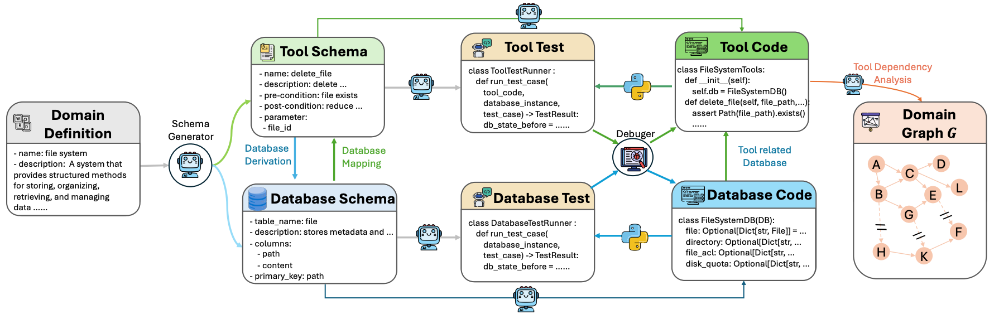
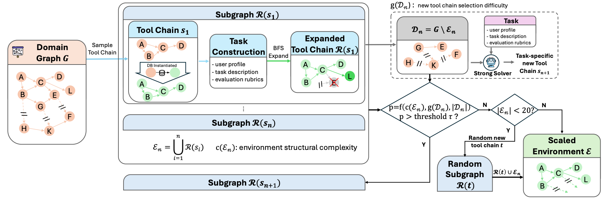
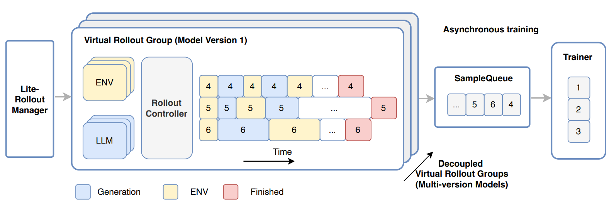
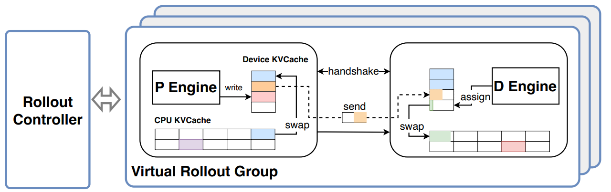
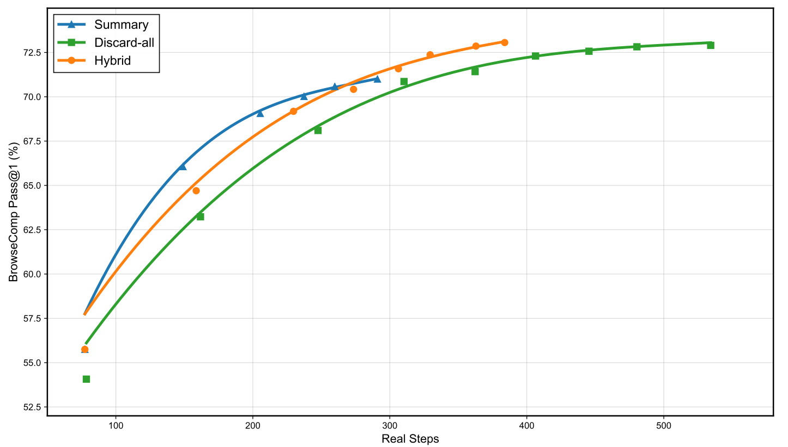
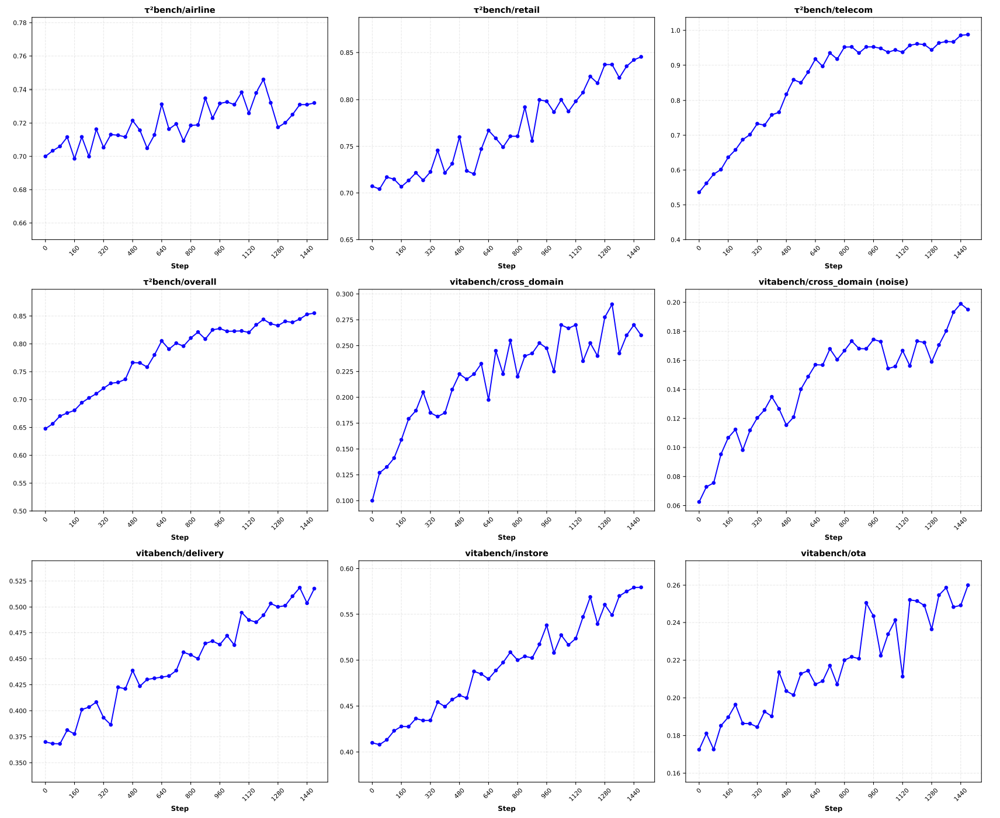
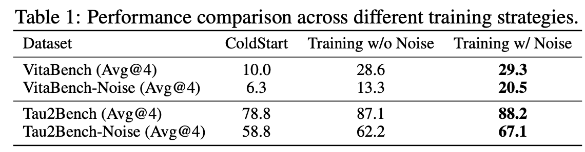
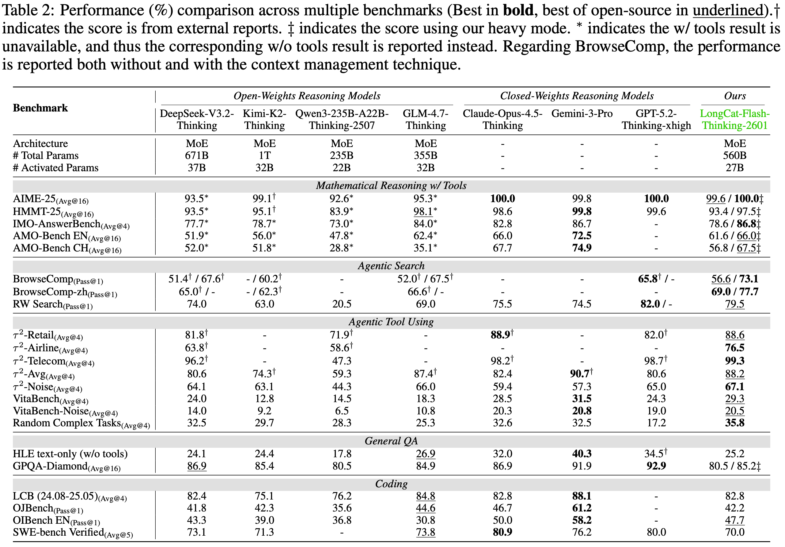

> 💡 [**LongCat-Flash-Thinking-2601**](https://arxiv.org/pdf/2601.16725)：在 LongCat-Flash 系列基础上，通过 mid-training 和 post-training 重点强化模型的 **agentic reasoning** 能力。

相比传统 reasoning 行为，agentic 场景通常涉及 long-horizon 轨迹。现实语料中这类交互轨迹非常稀缺，导致原始模型并不天然熟悉多轮、多步、带工具反馈的任务推进方式。

# 背景

目前大模型在数学、代码、复杂推理任务上已经取得巨大突破，部分能力接近甚至超过人类专家水平，**内在推理能力正在逼近上限**。

但真实世界任务并不总是封闭式、单次推理任务。由于自然语料中涉及 agentic 行为的内容天然稀缺，模型的 **agentic 行为不稳定、效率低、效果差，只会想、不会做**，这极大限制了模型处理复杂问题的能力上限。

因此，下一阶段的突破来自于 **与外部环境交互的能力，也就是 Agentic Reasoning**：

- 通过与外部环境的自适应交互解决复杂问题。
- 学会判断使用时机、使用目标、使用方法、过程容错和信息整合。
- 在多轮、多步交互中持续推进任务，而不是停留在单次回答。

LongCat 团队的目标，是将大模型 **从强推理模型升级为可泛化、可交互、可扩展、可在真实环境中稳定运行的 Agentic 系统**，让推理与交互行为真正融合。

为此，论文围绕 long-horizon trajectory、异构环境、长尾交互模式三大核心难点，在算法、数据、环境构造与系统层面完成了全链路协同设计。

# 数据构建

## 环境构建

不同于传统 reasoning 主要在语义空间内推理，agentic reasoning 的强化必然涉及环境构建。**环境决定了模型的行为集合**，并且需要面对异构性、可执行可验证、规模化等挑战。

文章主要介绍了 coding 和常规 agentic tool-use 两个场景下的环境构建方式。

### Code Sandbox

Code Sandbox 是一个允许 agent 通过终端工具实时交互的可执行沙箱，已经成为强化 coding 类任务的必要条件之一。LongCat 团队主要做了两点优化：

1. 将常用工具整合到标准化环境接口中，包括搜索、文件读写、代码编辑、shell 执行。
2. 设计高并发 sandbox 调度系统，支持沙箱的异步创建、任务分发、自动回收，降低大规模训练下的环境启动和阻塞开销。

### Agentic Tool-Use

Agentic reasoning 能力的 **核心在于泛化**。模型需要在足够多样的环境中反复试错，学会有效的推理和交互行为，并泛化到更多陌生场景。

为了获取足够多样的环境，手工构造显然不可行。LongCat 团队设计了一个用于环境自动生成的 pipeline，核心分为三步。

#### Domain graph 构建

基于 domain 描述生成 tools、database 等环境必要元素。在 20+ 个领域下完成 domain graph 构建，每个 domain 有 60+ 可用工具，整体可用率 95%+。



Domain graph 构建包括：

1. schema 定义：从 domain 定义出发，生成 **工具 schema 集合**，并根据工具功能抽象出统一的 **数据库 schema**。
2. 逻辑补全：结合工具 schema 和数据库 schema，将每个 tool 变成 **真实可执行的 database 交互工具**。为确保代码生成结果正确、稳健，生成代码会通过单元测试验证。
3. 依赖分析：从已有工具中构建工具依赖 DAG 图，用于后续环境构建及扩展。例如 `tool_b` 的输入源于 `tool_a` 的输出，则构成一条 `tool_a -> tool_b` 的有向边。

#### 可执行环境构建

从工具 DAG 图中采样工具调用链路，完成可执行环境构建。



可执行环境构建包括：

1. 子链采样：从工具 DAG 图中采样一条工具调用链路 s₁ ⊂ G。
2. 实例化数据库：针对 s₁ 中的每个工具，依次实例化工具涉及的数据库状态。
3. 任务生成：基于 s₁ 生成任务，包括任务描述、user profile、evaluation rubrics。
4. 环境校验：对生成环境进行多次一致性校验，确保正确 tool chains 能通过 rubrics 验证，错误或残缺的 tool chains 无法通过验证。

#### 环境扩展

除 domain 多样性以外，难度多样性同样重要。LongCat 团队认为任务难度主要源于 **交互复杂性** 和 **环境复杂性**。

1. 交互复杂性体现为不同程度的澄清、规划和多步交互，从而鼓励模型展现丰富、适应性的 agentic 行为。
2. 环境复杂性体现为完成任务所需的工具个数和工具调用链路。
   - 环境复杂性的提升相对直接，也是本文主要的环境扩展方式：向 s₁ 中引入更多工具调用节点。
   - 具体做法是遍历 s₁ 未使用的工具集合 D₁ = G ∖ s₁，通过引入所有依赖均被满足的工具，使现有工具调用链路 s₁ 更复杂，并确保每个合成环境至少包含 20 个工具。

```text
# 工具 DAG 图
A. {"name": "createUser", "description": "创建用户"}
B. {"name": "addAddress", "description": "给用户添加地址"}
C. {"name": "createOrder", "description": "创建订单"}
D. {"name": "addItem", "description": "给订单加商品"}
E. {"name": "applyCoupon", "description": "给订单加优惠券"}
F. {"name": "processPayment", "description": "支付订单"}
G. {"name": "refundOrder", "description": "退款"}
H. {"name": "generateInvoice", "description": "生成物流订单"}
I. {"name": "queryLogisticsStatus", "description": "查询物流状态"}

A - B
  - C - D
      - E
      - F - G
          - H - I

# 子链采样
s1 = {A - C - D - F}  # 创建用户 - 创建订单 - 添加商品 - 支付
数据库依赖：用户、订单已创建，商品已添加，订单已支付

# 基于 BFS 的环境复杂化
遍历 s1 外的节点：
- B/G/H 由于前置依赖均已满足，可以考虑加入 s1
  {A - C - D - F - G}
  {A - C - D - F - H}
  {A - B - C - D - F}
- I 由于涉及额外的数据库依赖（物流订单号），无法加入 s1
```

## 任务构建

在 RL 中，**环境决定 agent 能做什么，task 决定 agent 要做什么**。一个好的 task 必须满足：

1. 信息充分：能有效区分 policy 质量，产生有效梯度信号。
2. 难度适中：确保模型能但又不总是能 rollout 出期望轨迹。

不同领域的 task 分布天然存在很大差异。Coding 领域有大量复杂且高质量的任务，但 agentic search、tool-use 场景下的任务就十分稀缺。

### Agentic Search

LongCat 团队将搜索类任务的难度归因于 **多跳关系推理** 和 **歧义约束推理**，并针对这两点构建复杂 task。

#### Graph-based QA

针对多跳关系推理，合成 **存在明确链式推理流程** 的任务，强制模型必须依赖推理，而不是仅靠关键词匹配完成任务。

Graph-based QA 包含：

1. 基于 wiki 构建 mini KG：采样 wiki 中的低频实体，同时不断扩展实体关系 graph。
2. 问题生成：采样 sub-graph 用于问题生成。
3. 问题复杂化：刻意隐藏数字、位置、时间、实体名称等明确细节，最大限度增加推理复杂度。
4. 质量过滤：去除存在歧义解的问题。

```text
# 实体采样
Entity A: Film X

# 关系图构建
Film X
   |-- releasedIn -> 1998
   `-- directedBy -> Director Y
                        `-- bornIn -> City Z
                                         |-- locatedIn -> Europe
                                         `-- CapitalOf -> Country W

# 子图采样
Film X -> Director Y -> City Z -> Country W

# 问题生成
Which country is the birthplace of the director of Film X?

# 模糊化
The director of a certain film released in 1998 was born in a city
that is the capital of a European country. Which country is it?
```

#### Agent-based QA

针对歧义约束推理，合成 **存在多个歧义解、需要结合限制条件给出最符合要求答案** 的任务。具体通过由 FSM 控制的 MAS 系统进行问题合成：

1. 实体抽取 agent：识别有代表性的长尾实体并提取其 **显著属性**，这些属性作为合成问题的基础真实信息。
2. 问题合成 agent：对抽取出的显著属性随机采样，制定针对性问题。
3. 验证 agent：利用搜索和浏览工具严格验证基础真实信息是否满足问题中的所有约束条件，降低实体与问题不匹配的风险。
4. 答案生成 agent：利用搜索和浏览工具生成候选答案。
5. Judge agent：评估候选答案与预定义基础真实信息之间的一致性。

```text
# 实体抽取
<Scientist A, attends, University U>

# 问题合成
Which university did Scientist A attend?

# 问题验证
> Scientist A attended two universities.
Which university did Scientist A attend after he got married?

# 答案生成
University U
```

### Agentic Tool-Use

Tool-use task 在生成环境时同步定义。也就是说，环境构建不仅产出可执行工具和数据库状态，也同时产出任务描述、用户画像和 evaluation rubrics。

## 冷启动

冷启动阶段的目标不在于 benchmark 分数有多高，而是希望模型在当前任务下具备稳定、多样的行为模式，**为 RL 阶段的充分 explore 奠定基础**。因此，冷启动数据必须满足：

1. 能完成 RL 目标。
2. 保持通用 thinking 能力。
3. 推理路径多样化。
4. 交互格式稳定。

### General Thinking

Agentic 能力以通用 thinking 能力为基础。为了收集高质量数据，文章结合 **KCG 与滑窗 PPL** 进行数据筛选，收集尽可能多样、能充分暴露模型当前 thinking 能力缺陷的 210k 数据用于模型冷启动。

传统 PPL 过滤容易被全序列平均稀释，LongCat 团队引入 sliding-window PPL：在序列内用窗口计算局部 PPL 峰值，从而捕捉模型真正不确定、但对训练有信息量的片段。

### Agentic Coding

在 math、coding 等场景下，现实世界中存在大量数据源，此时主要问题在于轨迹的筛选与整合。LongCat 团队通过严格的质量控制和可执行性验证确保轨迹质量：

1. 确保每条进入冷启动阶段的轨迹，在 **可复现的环境中完全可执行且可验证**。
2. 为避免幻觉，移除错误及冗余操作。
3. 通过压缩早期步骤，保留 long-horizon 推理和迭代式调试过程。

### Agentic Search

对于 search、tool-use 等大多数智能体任务，高质量的现实世界轨迹在很大程度上是 **不存在** 的，因此需要设计相应的 **数据合成流程** 来构建冷启动轨迹。

为了确保轨迹的正确性、完整性，以及对 shortcut 行为的鲁棒性，合成轨迹时需要：

1. 强制要求推理和 tool-use 格式一致。
2. 强制要求轨迹包含 query 中所有条件的完整性验证，禁止基于部分信息的 shortcuts。
3. 通过压缩早期步骤，保留 long-horizon 推理。

### Agentic Tool-Use

Tool-use 冷启动的主要难点在于异构环境下的交互行为建模。基于环境构建 pipeline，LongCat 团队继续构建轨迹合成 pipeline，并从 **多样性** 和 **质量** 两个角度进行筛选：

1. 多样性：每个任务可能有多种 tool-use 使用路径、对话风格和行为模式。
2. 质量：所有轨迹必须经过 verify；训练时对异常轮次进行 mask，例如失败的工具调用或格式违规。

# 异步 Agentic RL 框架：DORA

传统 Agentic RL 一般需要等整个 batch rollout 完再一起训练。一个 rollout 包含 `LLM 生成 -> 调工具 -> 等环境返回 -> 再生成 -> 再调工具` 等多个步骤，因此通常是 **多轮、长轨迹、环境返回存在执行延迟、不同样本长度差异巨大**，短板效应明显，GPU 利用率极低。

为此，LongCat 团队提出异步 Agentic RL 框架 DORA：rollout 生成好后立即进入训练队列，不必等待整个 batch。



DORA 的核心结构包括：

1. **RolloutManager**：负责管理 rollout 过程、调度 LLM 和环境、收集 reward，是完全异步的单样本级 streaming。系统同时将 RolloutManager 拆分为轻量级 RolloutManager 和多个 RolloutController。前者管理全局控制元数据，后者以 DP 方式各自管理一组环境，保证大量环境可以高效部署。
2. **SampleQueue**：控制样本新鲜度。在异步系统中，有些样本由旧模型生成，有些由新模型生成，因此需要解决样本过期问题。
3. **Trainer**：负责经验构造、GSPO 优化和参数更新，训练可以和 rollout 并行。

DORA 还采用了 **Prefill-Decode 分离**。Agentic RL 任务中 context 很长、请求频繁，Prefill 是计算密集型，Decode 是访问密集型。两者混跑会互相拖慢，尤其在大规模 MoE 和长轨迹 RL 下会明显降低吞吐。



# RL 训练

## 通用 RL 策略

在大规模 RL 中，训练集涵盖的 **任务难度差异极大**。如果对所有任务做简单统一处理，往往会导致学习效率低下。

为此，LongCat 团队设计了一套训练策略，**确保将计算资源集中在当前最高效的 task 上**：

1. **双轴课程学习**：从任务和能力两个角度对 task 进行分级。
2. 难度维度：通过 `pass@K` 排序，先学简单样本，再学难样本。
3. 能力维度：先学基础 tool-use，再学多步规划，再学复杂组合。
4. **预算动态分配**：通过 vᵢ,ₜ = V(τᵢ | πθₜ, 𝐦ₜ) 估计任务价值，用 heap-based greedy algorithm 分配 rollout 预算。模型现在弱在哪，就多 rollout 哪种 task。
5. **自校验**：将自验证加入奖励信号。当生成 RL 趋于平缓时，把自验证作为辅助任务加速模型收敛。

## Agentic RL 策略

传统 RL 一般侧重于稳定策略优化、提高样本效率，以及 explore 与 exploit 之间的权衡。但 Agentic RL 下会出现新的问题：多轮交互与不可预测的环境反馈容易导致 context 爆炸，进而超出 `max_len`、轨迹不完整，破坏训练信号。

为了在不牺牲 reasoning 质量的情况下控制上下文长度，LongCat 团队提出了新的 context 管理策略：

1. **Summary-based**：超过 80K token 后，将历史 tool call 压缩成 summary，并专门构造 15K 总结数据用于冷启动。
2. **Discard-based**：超限后丢弃全部 tool-use 历史，重新开始生成，类似 DeepSeek 系列做法。
3. **Hybrid**：本文采用的方法，将 Summary-based 与 Discard-based 结合。当 `seq_len > 80K` 时先触发 summary；当交互轮次持续增加、超过阈值时触发 reset。



通过观察 RL steps 与 benchmark score 曲线，各 benchmark 分数随着 RL 流程稳步上升，验证了 agentic 环境合成流程的有效性，以及 agentic reasoning 的泛化能力。



考虑到真实世界中存在噪声环境，例如 API 失败、返回错误、数据不一致，训练中还会主动注入噪声，并用 curriculum 逐步增加噪声强度，让模型学会 retry、fallback、自我纠错：

1. **Instruction noise**：模拟交互过程中的模糊性、可变性。
2. **Tool-use noise**：模拟外部工具返回失败、不一致、不完整等行为。



# 模型评测

> 💡 LongCat-Flash-Thinking-2601 在传统 reasoning 任务上具有竞争力，同时在 agentic reasoning 上具有明显优势：在保持顶级数学和通用能力的前提下，agentic tool-use 能力在开源模型中达到 SOTA。



评测结果可以从几个角度理解：

1. **数学推理**：处于第一梯队水平，Heavy mode 下接近顶级闭源模型。AIME-2025 在 Heavy mode 下取得满分；IMO-AnswerBench 得分 86.8，属于 SOTA 水平；AMO-Bench 下为开源 SOTA。
2. **Agentic Search**：在 BrowseComp 和 BrowseComp-ZH 上 SOTA。
3. **Agentic Tool-Use**：`tau2-Bench` 表现仅次于 Gemini-3-Pro。
4. **General QA**：通用 QA 没有因 agentic 训练而退化，强度仍然在线。
5. **Coding**：虽然不是第一，但仍属于第一梯队。

需要注意的是，LongCat 在 math 评测时允许模型使用代码；BrowseComp 与 tool-use 相关 benchmark 也有一定修改。

# 总结与思考

相比 K2-Thinking、DeepSeek-V3.2、MiMo-V2-Flash 等开源模型，LongCat-Flash-Thinking-2601 可以看作是 agentic reasoning 路线的一次系统化整合。

它的价值主要体现在两点：

1. 给出了更加详尽、完备的数据构成思路，并且数据合成 pipeline 始终贯彻 agentic RL 的基本原则：**可执行、可验证**。
2. RL 中也针对实际会遇到的问题给出了解法：课程学习与计算资源合理分配、环境异构、上下文管理、噪声鲁棒性。

Agentic RL 的方法方向一直相对明确。LongCat 团队的 contribution，不仅在于把方法落地，也在于回答了强化 agentic reasoning 的意义：不同于传统 reasoning 数据，这类语料在真实世界是稀缺甚至不存在的，因此需要定向合成和强化，让模型突破只会想的桎梏。
