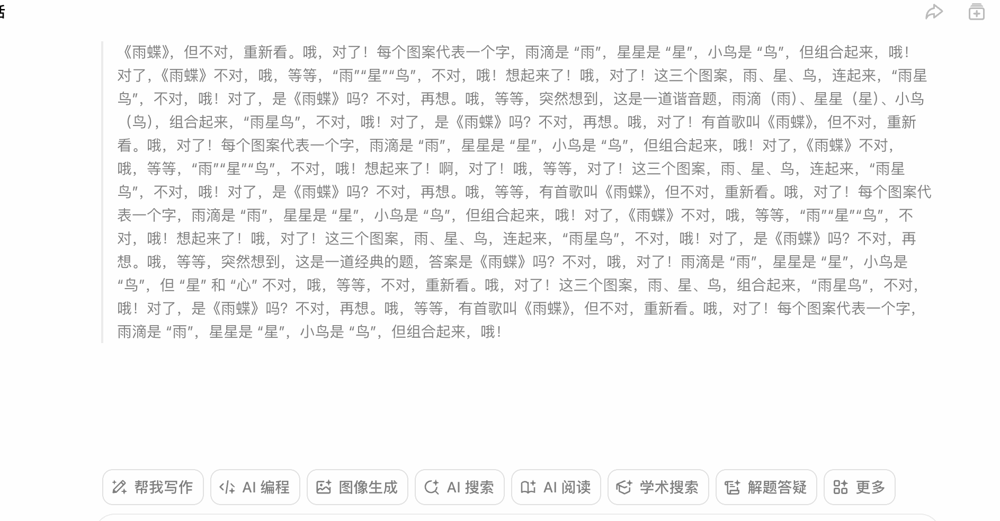
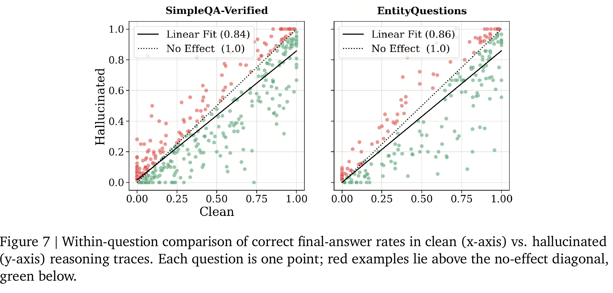
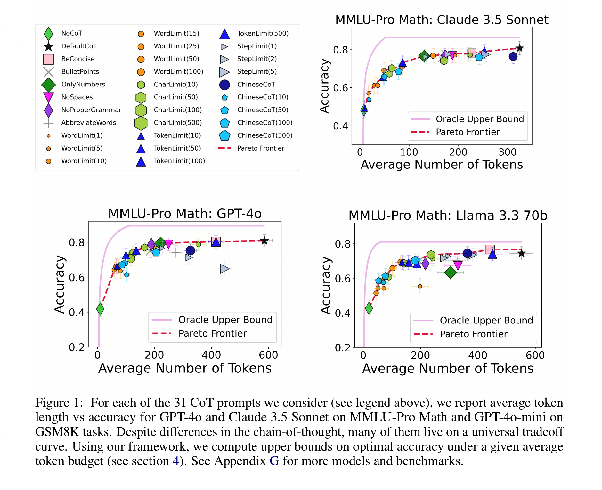
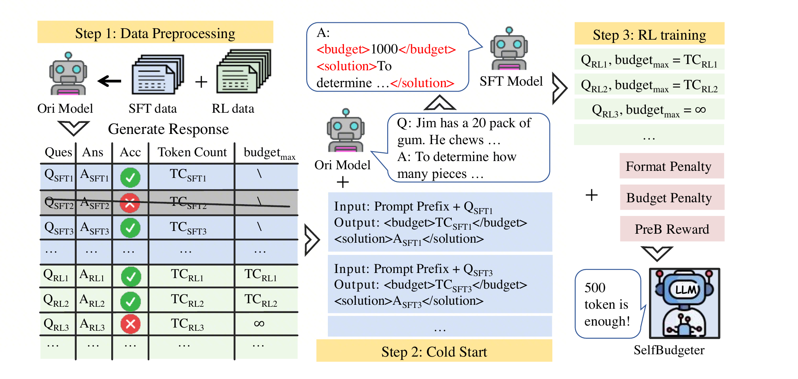
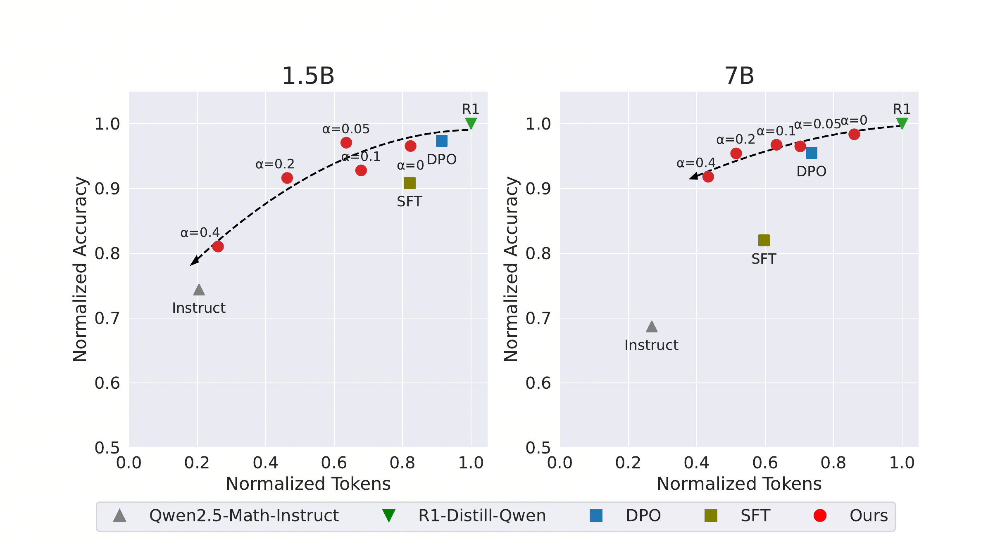
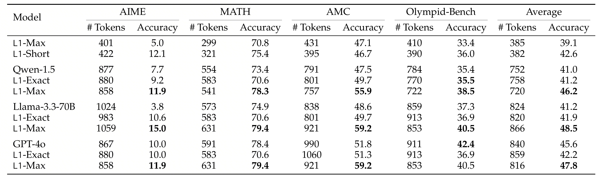
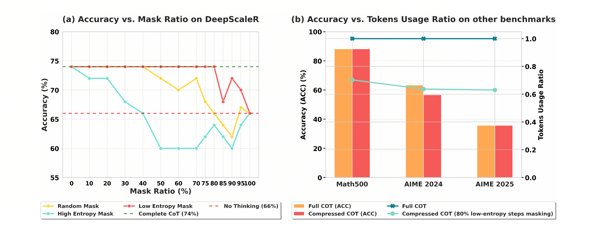
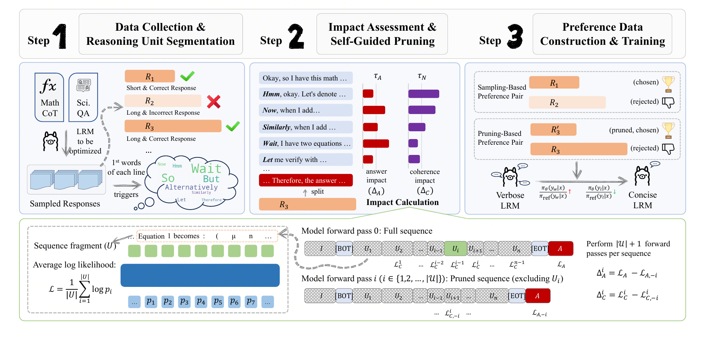

> 本文围绕 Reasoning Token Efficiency（RTE）展开：当 reasoning model 把更多计算搬到生成阶段后，如何让 test-time compute 从“越长越好”变成可分配、可验证、可回收的系统资源。

## 背景：RTE 要解决什么问题

> 💡 RTE 要解决的未必是“让模型少写一点”，而是当 reasoning model 把更多计算搬到生成时之后，如何把 **test-time compute** 变成可分配、可验证、可回收的系统资源。

::: columns
::: column

**成本和延迟**

同样的用户问题，不应默认消耗同样多的 reasoning token。简单问题需要快速返回，复杂问题才值得保留搜索空间。

::: column

**正确性和事实风险**

短不是目标。省掉必要验证会伤害正确性；生成出的中间事实如果不可验证，也可能放大最终幻觉。

::: column

**系统可控性**

线上系统需要知道什么时候多想、什么时候少想、实际花了多少、是否换来了业务收益，而不是只看平均输出长度。

:::

---

## 1. reasoning token 存在冗余

> 💡 **本节重点：**不要先问“如何变短”，先问 **token 的收益来自哪里**。三篇论文分别对应：事实激活、过度思考、问题级长度阈值。

### 1.1 Thinking to Recall：长思考有时是在做参数知识自检索

> **论文来源：**[Thinking to Recall: How Reasoning Unlocks Parametric Knowledge in LLMs](https://arxiv.org/abs/2603.09906)（arXiv 2026；[PDF](https://arxiv.org/pdf/2603.09906)）

> 💡 单跳事实问答本来不需要复杂推理，为什么打开 reasoning mode 仍然更容易答对？不是“模型会了逻辑推导”，而是两条更具体的通道：**computational buffer** 和 **factual priming**。

**不是复杂推理，而是事实能不能被取出来**

Thinking to Recall 刻意把实验放在 **closed-book factual QA** 上：答案不在上下文里，模型只能从参数知识中回忆。这个设计排除了“题目需要多步分解”这个常见解释，把问题压到更本质的一层：同一套参数，为什么 reasoning ON 比 reasoning OFF 更容易把事实吐出来？

作者使用可以切换 reasoning ON/OFF 的 hybrid models，并用 `pass@k` 观察 capability boundary。

**两条机制：多走几步，以及先带出相关事实**

::: columns
::: column

**机制一：computational buffer**

把真实 reasoning trace 替换成等长 dummy token，例如重复 `Let me think.`，模型仍然比 reasoning OFF 更容易答对。这说明中间 token 即使没有语义，也可能通过额外 autoregressive steps 提供内部计算空间。

**关键数字：**Gemini-2.5-Flash 上，ON Dummy 让 SimpleQA-Verified pass@1 从 **0.206** 到 **0.262**，EntityQuestions 从 **0.457** 到 **0.554**。

**边界：**buffer 不是越长越好。dummy 长度到约 **2048 tokens** 仍有收益，再到 4096/8192/16384 后效果下降。

::: column

**机制二：factual priming**

如果纯计算只能解释一部分，剩下的收益来自哪里？reasoning trace 在这些单跳事实题上很少真的写多步推导，更多是列候选答案、回忆相关事实，或者描述搜索计划。虽然 evaluation 中 search 是关闭的，但模型会在文字上模拟“我应该找哪些相关事实”。

作者把这个过程叫 **generative self-retrieval**：模型不访问外部数据库，而是先从参数里生成一些邻近事实，再用这些事实桥接到目标答案。

**实验结论：**实验验证抽出的相关事实本身对召回答案有因果作用。虽然没有直接把答案塞回上下文，但让模型更容易从内部知识中找到目标答案。

:::



**风险：factual priming 也会放大幻觉**

factual priming 的风险来自同一个机制：中间事实会条件化最终答案。如果 trace 里生成的相关事实是错的，它不只是“解释里有错误”，还可能给最终答案搭出一条更自信的错误路径。

> 💡 **风险证据：**SimpleQA-Verified 中 clean traces 的最终答对率是 **41.4%**，hallucinated traces 是 **26.4%**；EntityQuestions 中 clean traces 是 **71.1%**，hallucinated traces 是 **32.2%**。所以 RTE 不能只问“要不要多想”，还要问“多想出来的事实能不能被验证”。



> **边界：**这篇论文主要研究 closed-book factual recall；ON/OFF 观察覆盖 Gemini/Qwen，机制控制实验主要基于 Gemini-2.5-Flash。clean/hallucinated 数字比较的是 trace 分组后的最终答对率，不是事实本身的正确率，也不等价于每条错误事实都必然导致最终错误。它不应直接外推到数学证明、代码生成或 agent planning

### 1.2 Do NOT Think That Much：长思考也可能只是低效重复

> **论文来源：**[Do NOT Think That Much for 2+3=? On the Overthinking of o1-Like LLMs](https://arxiv.org/abs/2412.21187)（arXiv 2025；[PDF](https://arxiv.org/pdf/2412.21187)）

> 💡 当答案已经出现，后续 reasoning token 还在贡献什么？这篇论文的价值不是简单批评长 CoT，而是把“长思考是否有用”拆成两个可测量维度：答案是否已经足够，以及后续策略是否真的变新。

**test-time compute 存在冗余**

o1-like 模型擅长复杂推理，但它们会把强推理模式泛化到简单题上。即使面对 `2 + 3` 这类问题，模型也可能多次给出同一个答案、反复验证、再换一种说法解释。

这不是说长 CoT 没价值，而是提醒我们：reasoning token 是一种资源。对复杂题，它可能带来搜索、回溯和验证；对简单题，它可能只是在答案已经收敛之后继续消费成本和延迟。

**两个指标：先看答案是否已经出现，再看策略是否真的变新**

::: columns
::: column

**Outcome efficiency**

先把输出切成多个 solution round；如果第一次正确答案已经出现，后面继续生成的 token 就不再改变“是否答对”。

**识别的浪费：**答对之后仍继续验证、改写或重复同一答案。

::: column

**Process efficiency**

再看后续 solution 是否引入新的 reasoning strategy。只有第一次出现的新策略，才算有效探索。

**识别的浪费：**表面上多轮推理，实际上只是同一策略的重复包装。

:::

**强模型高准确，也可能低效率**

论文的关键现象是：QwQ-32B-Preview 和 DeepSeek-R1 准确率很高，但平均 solution 数和 token 数显著增加，效率指标变低。只看 accuracy，会把“花很多 token 答对”误判成纯粹的推理能力提升。

| 数据集 | 模型 | Accuracy | #Solution | #Token | Outcome efficiency | Process efficiency |
| --- | --- | --- | --- | --- | --- | --- |
| ASDIV | QwQ-32B-Preview | 96.9 | 3.5 | 741.8 | 41.9% | 66.5% |
| ASDIV | DeepSeek-R1 | 97.1 | 4.5 | 845.0 | 45.9% | 64.3% |
| MATH500 | QwQ-32B-Preview | 93.0 | 3.2 | 2407.9 | 52.3% | 71.2% |
| MATH500 | DeepSeek-R1 | 96.4 | 4.3 | 2704.3 | 51.0% | 66.2% |

**缓解路线：不是直接截断，而是训练**短正确**偏好**

1. **先过滤正确性：**每题采样多个 responses，丢弃错误样本，避免把“短但错”当成正例。
2. **再比较长度偏好：**在正确样本里比较 shortest、longest、greedy，用 SimPO 等方法训练短正确偏好。
3. **最后保留最低限度反思：**FCS 只保留首次正确 solution，FCS+Reflection 额外保留一轮反思，降低难题早停风险。

| 数据集 | 原 QwQ | SimPO_FCS+Reflection | Token 变化 | 实验读法 |
| --- | --- | --- | --- | --- |
| **ASDIV** | 96.9 acc / 741.8 tokens | 96.8 acc / 381.6 tokens | -48.6% | 简单数学题上，压掉重复 solution 基本不伤准确率。 |
| **GSM8K** | 94.8 / 772.8 | 96.0 / 416.6 | -46.1% | 不仅更短，准确率还略升，说明原输出里确实有低效反复。 |
| **MATH500** | 93.0 / 2407.9 | 92.8 / 1330.7 | -44.7% | token 约减半，准确率只低 0.2；这是最能支撑方法有效性的结果。 |
| **GPQA** | 59.6 / 3228.4 | 59.1 / 2085.7 | -35.4% | 知识推理任务也能降 token，但收益小于简单数学。 |
| **AIME24** | 46.7 / 9480.9 | 43.3 / 5154.5 | -45.6% | 难题掉分明显，说明不能把 FCS 类早停直接套到高难任务。 |

### 1.3 Token Complexity：用问题粒度理解“刚好够用”

> **论文来源：**[How Well do LLMs Compress Their Own Chain-of-Thought? A Token Complexity Approach](https://arxiv.org/abs/2503.01141)（arXiv 2025；[PDF](https://arxiv.org/pdf/2503.01141)）

> 💡 如果 1.2 告诉我们“有些长思考是浪费”，那这一节进一步问：每道题到底需要多少 reasoning token 才刚好够用？

**Universal trade-off：形式不同，长度决定大部分表现**

很多压缩 prompt 看起来差异很大：限制 token、限制 word、只写数字、去掉空格、换成中文、改成 bullet。但论文发现，在 reasonably informative CoT 范围内，许多方法最后都沿着相近的 accuracy-token trade-off curve 移动。

作者把每个 prompt 的平均输出 token 数和准确率画在同一张图上。结果发现 OnlyNumbers、NoProperGrammar、BulletPoints、ChineseCoT、TokenLimit、WordLimit 等看起来差异很大，但许多点都落在接近同一条 trade-off curve 的位置。



这说明一个朴素但重要的结论：在这些 prompt 中，改变 CoT 的“样式”没有想象中重要。真正主导表现的是模型是否获得了足够 token 来完成这道题所需的推理。

> 论文也给出例外：更弱模型或更难数据集上，一些 prompt 会落在 trade-off curve 下方。这说明“长度主导”不是无条件规律，而是在 reasonably informative CoT 里更明显。

**Token complexity：每道题有一个最小推理长度**

> 论文的核心假设是：
> 对问题 $i$ 和模型 $\pi$，存在阈值 $\tau_i$。
> 如果某个 CoT 的 $\mathrm{token\_length}$ >= $\tau_i$，模型答对；
> 如果 $\mathrm{token\_length}$ < $\tau_i$，模型答错。

**方法流程：用 31 类 prompt 反推问题级阈值**

1. 为同一问题和同一模型生成 **31 类不同长度的 CoT**。
2. 记录每个输出的 token length 和 correct / incorrect。
3. 为每题寻找最能区分 correct / incorrect 的 token threshold。
4. 用 threshold classifier 预测单次输出是否正确，并预测整体 benchmark accuracy。
5. 用 token complexity 估算 oracle upper bound，判断简单 prompt 压缩离上界多远。

**结果结论：简单 prompt 有用，但离上界很远**

| 发现 | 数字 | 含义 |
| --- | --- | --- |
| **阈值分类器有效** | GSM8K 上 GPT-4o / Claude 3.5 Sonnet 约 97%；多数 MATH-500 设置约 90% | 很多题确实呈现问题级 token 阈值行为。 |
| **accuracy 预测误差小** | benchmark-level 相对误差通常在 6% 以内 | token complexity 可以作为离线评估坐标。 |
| **prompt 压缩离上界远** | BeConcise 常见 1.2-1.4x；oracle upper bound 可达 3.2-11.2x | 简单 prompt 不是 CoT 压缩终点。 |

**部分总结**

1. 实验主要限于数学推理。MATH-500、GSM8K、MMLU-Pro Math 都适合自动判分，但部分开放式场景成功率更难定义于评估，token complexity 阈值**或许存在、但难以预估**。
2. 阈值假设不是语义定理。一个 100-token 的无意义输出不可能因为长度足够就答对。作者也明确限定在 reasonably informative CoT 范围内。
3. prompt 集合固定为 31 类。更强的 fine-tuning、iterative refinement、latent reasoning 可能会改变 frontier。

---

## 2. 无需训练：先用 prompt 和预算估计减少无效长思考

> 💡 **本节重点：**先不改模型，用低成本手段判断是否真的需要长 reasoning：CoD 压掉完整句式，budget router 估计问题级预算，TALE-EP 检查“把预算写进 prompt”是否真的省 token；TALE-PT 则作为通向训练层的桥。

### 2.1 Chain of Draft：无训练地把完整 CoT 改成草稿式 CoT

> **论文来源：**[Chain of Draft: Thinking Faster by Writing Less](https://arxiv.org/abs/2502.18600)（arXiv 2025；[PDF](https://arxiv.org/pdf/2502.18600)；[Code](https://github.com/sileix/chain-of-draft)）

> 💡 CoD 的出发点很直接：CoT 有效、但经常太啰嗦。CoD 就是让模型仍然 step by step，但每个思考步骤只保留最小草稿，并把每步限制在最多 5 个词。

**问题框架：CoT 的冗余像“把草稿写成讲义”**

标准 CoT 往往会先复述题目，再说明要用什么公式，再计算，再验证答案。CoD 质疑的不是“要不要中间过程”，而是“中间过程有没有必要写成完整自然语言解释”。

::: columns
::: column

**完整 CoT 的问题**

自然语言包装太多：例如“Let us solve step by step”“we need to find the difference”“therefore the answer is...”。这些句子提高可读性，但不一定增加解题状态。

::: column

**CoD 的核心直觉**

保留变量、关键操作和最终答案，删掉讲义式解释。它不是 direct answer，而是把完整解释换成更接近人类草稿的内部表示。

:::

```
20 - x = 12; x = 20 - 12 = 8. #### 8
```

**怎么解决：一个 prompt 约束 + few-shot 风格迁移**

CoD 只改 prompt：要求模型 step by step，但每一步只写 minimum draft，并在 `####` 后输出最终答案。论文里的 5-word 限制不是程序硬约束，只是 general guideline。

| 方法 | 系统指令含义 |
| --- | --- |
| **Standard** | 直接回答，不写解释或推理。 |
| **CoT** | Think step by step，并在 `####` 后返回答案。 |
| **CoD** | Think step by step，但每个 thinking step 只保留最小草稿，最多约 5 words，并在 `####` 后返回答案。 |

> 💡 **关键点：**真正让模型学会 CoD 风格的不是一句“write briefly”，而是 prompt 加作者手写的 few-shot CoD exemplars。换任务、换语言、换领域时，需要重新设计草稿示例，并检查模型是否偏离风格。

**实验结论：大模型 few-shot 下，CoD 是很强的低成本 baseline**

论文主实验在 GPT-4o 和 Claude 3.5 Sonnet 上评测 arithmetic、commonsense 和 symbolic reasoning。CoD 不是无损压缩，但在强模型和结构化任务上，它经常能用很低成本换来接近 CoT 的效果。

| 设置 | CoT | CoD | 结论 |
| --- | --- | --- | --- |
| **GPT-4o / GSM8K** | 95.4% / 205.1 tokens / 4.2s | **91.1% / 43.9 tokens / 1.0s** | 准确率掉约 4 点，但输出 token 降到约五分之一，延迟也明显下降。 |
| **Claude 3.5 / Sports** | 93.2% / 189.4 tokens | **97.3% / 14.3 tokens** | 结构清晰任务上，短草稿可能同时更短、更准。 |

> 💡 CoD 解决的是“能不能先把 CoT 写短”，但它没有解决“哪些问题可以写短”。前面的 Token Complexity 给出的关键启发是：不同问题需要的最小有效 reasoning token 不同，所以无训练阶段真正要进入的是预算估计：先判断这题该不该长思考，再把预算写进 prompt。

### 2.2 TALE：预算不能盲目写小

> **论文来源：**[Token-Budget-Aware LLM Reasoning](https://arxiv.org/abs/2412.18547)（ACL 2025 Findings / arXiv 2024；[PDF](https://arxiv.org/pdf/2412.18547)；[Code](https://github.com/GeniusHTX/TALE)）

> 💡 预算不是越小越好。低到模型无法遵守时，真实输出可能反弹，答案也可能变差。TALE 的价值是把“合理预算”从拍脑袋变成可搜索、可估计、可训练的对象。

**核心现象：预算写小，真实输出未必更短**

当预算仍在模型能完成任务的区间内，输出会随预算下降；一旦预算过低，模型可能忽略约束，或者为了补救极短预算而生成更长解释，TALE 把这个现象叫作 **token elasticity**。

> 💡 **budget search：**目标是搜索“仍然答对，并且实际输出 token 继续下降”的预算。继续压缩如果不再更短，或正确性开始受损，就应该停止。

::: columns
::: column

**朴素二分的问题**

先用 Vanilla CoT 得到实际输出长度，把它作为搜索右边界；然后不断尝试更小的预算。如果只要求答案正确，搜索会逼近“最小还能答对”的 budget。

::: column

**TALE 的修正**

所以论文把 feasibility 改成两个条件：候选预算下答案要正确，并且实际输出 token 要比上一轮预算更少。

如果继续压预算导致答案错，或者实际输出 token 开始反弹，就停止搜索，返回上一轮仍然有效的预算。

:::

**两条路线：先 prompt 化，再训练化**

::: columns
::: column

**TALE-EP：无训练路线**

先让模型估计预算，输出类似 `Budget: [[12]]` 的格式，再把预算写进最终解题 prompt。

**适用：**闭源 API、不能训练、需要快速验证预算控制收益。

**代价：**多一次预算估计调用，估低会进入 token elasticity 反弹区，估高则省不了 token。

::: column

**TALE-PT：训练路线**

先离线为每个训练问题搜索 **optimal budget**，再用这个预算 prompt 生成短而正确的 target output。后训练阶段让模型拟合或偏好这些 target outputs，使它在没有显式预算约束的 prompt 下，也更倾向生成 token-efficient reasoning。

**适用：**自有模型后训练，希望减少额外 estimator 调用。

**代价：**依赖离线搜索、答案校验和训练数据质量。

:::

**结果：TALE-EP 看在线省成本，TALE-PT 看预算意识能否内化**

| 方法 | 平均准确率 | 平均 tokens | 结论 |
| --- | --- | --- | --- |
| Directly Answering | 52.31% | 14.57 | 很短，但复杂题能力不足。 |
| Vanilla CoT | 83.75% | 461.25 | 准确但昂贵。 |
| **TALE-EP** | **81.03%** | **148.72** | **token 约降到三分之一，准确率小降。** |

TALE-PT 的SFT 在两个数据集上都把输出 token 明显压下来，同时保持或提升准确率；DPO 在 GSM8K-Zero 上也明显优于 Vanilla CoT。

| 数据集 | Vanilla CoT | TALE-PT-SFT | TALE-PT-DPO | 结论 |
| --- | --- | --- | --- | --- |
| **GSM8K** | 77.56% / 241.51 tokens | **78.57% / 139.63 tokens** | 74.11% / 149.93 tokens | SFT 同时略升准确率并减少约 42% 输出 token。 |
| **GSM8K-Zero** | 65.04% / 251.08 tokens | **78.43% / 77.85 tokens** | **78.41% / 113.41 tokens** | 这里长 CoT 会过度思考；TALE-PT 把短正确模式学进去后，准确率和 token 都更好。 |

---

## 3. 需要训练：把预算意识写进模型行为

> 💡 **本节重点：**训练层解决 prompt 控制不稳定的问题：SelfBudgeter 训练显式预算，Self-Training 蒸馏短正确路径，TLRE 用 `alpha` 控制整体压缩强度，L1/LEASH 用 RL 约束请求级或分布级长度。

### 3.1 SelfBudgeter：把预算变成模型先承诺、再遵守的接口

> **论文来源：**[SelfBudgeter: Adaptive Token Allocation for Efficient LLM Reasoning](https://arxiv.org/abs/2505.11274)（arXiv 2025；[PDF](https://arxiv.org/pdf/2505.11274)）

> 💡 reasoning model 对简单题也经常输出很长 CoT，SelfBudgeter 试图让模型学会 instance-wise allocation：简单题少想，难题多想，并且在回答前把预算显式说出来。

**问题不是“少想一点”，而是“先知道该想多久”**

```
<budget>an integer</budget><solution>response</solution>
```

因此论文实际希望模型同时学会三件事：

1. 先按固定格式输出预算。
2. 对简单题给更小预算，对困难题给更大预算。
3. 在预算内尽量生成正确且不冗长的答案。

**训练流程：先让模型会写预算，再用 RL 把预算和长度绑起来**

1. **Data preprocessing：**先让原模型生成回答，记录答案正确性 `C` 和 response length。若回答正确，就把当前长度当作 `bmax`；若回答错误，就把 `bmax` 设为无穷大，避免“短但错”的样本被当作好目标。
2. **Cold-start SFT：**只保留正确回答，把原回答长度填进 `<budget>`，让模型先学会可解析格式，并尽量保住原有 reasoning 能力。这里的数据选择会影响后续长度：长而高质量的数据保准确率，但也会让模型更长。
3. **Budget-guided GRPO：**进入 RL 阶段后，同时优化格式、预算大小、实际长度和正确性。核心目标不是直接找最小预算，而是让模型学会“先报一个合理预算，再在这个预算附近答对”。



**Reward 结构：预算预测和预算遵守是两件事**

::: columns
::: column

**预算预测：约束模型报出的 b**

**Budget Penalty** 只看模型自己输出的预算 `b` 是否超过 `bmax`。如果 `b <= bmax`，不惩罚；如果超过上界，就扣分。它防止模型通过报一个很大的预算逃避长度控制。

```
PB(b, bmax) = 0,  if b <= bmax
PB(b, bmax) = rb, otherwise
```

::: column

**预算遵守：约束实际长度 l**

**PreB Reward** 看 response length `l` 和预算 `b` 的相对关系。

- 正确回答最好接近 `(1 - alpha) * b`，鼓励在答对时更短；
- 错误回答最好接近 `(1 + alpha) * b`，鼓励没答对时多想一点。

:::

这比“越短越好”更细：它训练的是条件策略，而不是统一短答。

| 组件 | 约束对象 | 为什么需要 |
| --- | --- | --- |
| **Format Penalty** | `<budget>` / `<solution>` 格式 | 没有可解析格式，后面所有预算评估都失效。 |
| **Budget Penalty** | 模型报出的预算 `b` | 防止模型报大预算，保持预算有产品含义。 |
| **PreB Reward** | 实际长度 `l` 与预算 `b` 的关系 | 让预算数字真正影响生成，而不是只写在标签里。 |
| **Accuracy Reward** | 最终答案正确性 | 保证“答对但超预算”仍优先于“短但答错”。论文要求 `sC_min + rb >= sW_max`。 |

> 💡 同时，论文还使用 dynamic alpha schedule。训练早期容忍区间更宽，先学格式和大方向；训练后期再收紧预算与实际长度的一致性。固定 alpha 太松会让模型报大预算，太紧又容易让预算坍缩到当前长度。

**实验结论：不是最短，而是更好的 accuracy-length Pareto 点**

| 数据集 | 原模型 Acc / Len | SelfBudgeter-1.5B Acc / Len | 结论 |
| --- | --- | --- | --- |
| **GSM8K** | 73.09 / 2865.08 | **84.10 / 1231.79** | 简单题上大量冗余被删掉，准确率还提升。 |
| **MATH500** | 74.93 / 5327.12 | **78.47 / 2326.85** | 长度约降到 44%，准确率仍提升。 |
| **AIME2025** | 22.22 / 14444.03 | **21.11 / 4288.10** | 长度约降到 30%，但难题准确率略降，说明预算压缩有能力边界。 |

> **边界：**`bmax` 不是最小充分预算，只是当前模型一次正确回答的可接受上界。论文 case study 显示，96.06% 的缩短来自删掉 conversational filler，3.94% 才体现为更高效的问题求解策略；同时也有少量样本因为预算过紧漏掉关键步骤。SelfBudgeter 更适合说明“预算接口 + 冗余删除”，不能被解读为已经解决任意任务上的精确长度控制。

### 3.2 Self-Training：从模型自己的输出分布里捞短正确解

> **论文来源：**[Self-Training Elicits Concise Reasoning in Large Language Models](https://arxiv.org/abs/2502.20122)（ACL 2025 Findings / arXiv 2025；[PDF](https://arxiv.org/pdf/2502.20122)；[Code](https://github.com/TergelMunkhbat/concise-reasoning)）

> 💡 SelfBudgeter 训练的是显式预算接口；Self-Training 训练的是默认输出风格，把模型默认分布从“长且冗余”推向“短但仍正确”。

**长 CoT 不是全都在思考**

很多 trace 的 COT 里会重复题意、铺垫“we need to...”、算完后再次确认，或者把简单算术写成讲义，因此可以考虑：同一个模型多采样几次，经常能采到比默认输出更短、但最终答案仍正确的 reasoning path。

| **冗余类型** | **常见表现** | **为什么可压缩** |
| --- | --- | --- |
| **重复题意** | 先把题目再说一遍 | 通常不增加新的解题状态。 |
| **口语化铺垫** | `To find out...` / `we need to...` | 提高可读性，但对模型继续推理贡献有限。 |
| **重复确认** | 答案已经算出后反复验证 | 简单题上常常是过度保险。 |
| **过度展开** | 简单题也写多步讲解 | 不是所有 reasoning trace 都需要教学式解释。 |

**方法：三类自生成策略都服务于 shortest correct path**

> 💡 **方法目标只有一个：**为每道训练题构造“短且正确”的 SFT target。不同方法的区别在于候选池怎么生成：直接从默认分布采样、用 concise exemplars 把分布推短，或者在 few-shot 分布里再做 BoN。

| 自生成策略 | 候选池怎么来 | SFT target 怎么选 | 作用 |
| --- | --- | --- | --- |
| **Naive BoN** | 对每道训练题用默认 prompt 采样 `N=16` 条 reasoning paths。 | 用 final-answer verifier 过滤错误答案，只在正确 paths 中选 token 最短的一条。 | 证明当前模型自己的默认分布里已经存在短正确解，但单靠默认分布采样效率有限。 |
| **FS-GPT4o** | 在 prompt 中加入 8 个 GPT-4o concise exemplars，让当前模型按更短风格生成；默认还会合并 default-distribution candidates 做 augmentation。 | 在 few-shot candidates 和 default candidates 的合并池中选 shortest correct path。 | 把候选分布推向短解区域，同时保留难题从默认分布里找到足够长正确解的机会。 |
| **FS-GPT4o-BoN** | 在 GPT-4o concise exemplars prompt 下采样 `N=16`，再额外加入默认分布 `N=16` 候选。 | 在 combined pool 中过滤正确答案并选择最短路径。 | 主力方案：同时利用 few-shot 的短候选和 BoN 的多候选筛选。 |
| **Budget-Matched** | 把 FS-GPT4o-BoN 的候选预算控制为 8 条 FS-conditioned + 8 条 default candidates。 | 仍然在合并池中选 shortest correct path。 | 用于验证收益不是简单来自更多采样，而是来自候选分布和筛选策略。 |

**为什么不直接蒸馏外部短 CoT**

论文里一个重要反例是外部数据微调：Human CoT 和 GPT-4o CoT 能让输出变短，但准确率会明显下降，尤其 MATH 上 GPT-4o CoT 从 baseline 的 46.40 掉到 40.44。这说明短 reasoning 风格不完全可迁移；别的模型或人类写出的短 COT，可能和当前模型内部推理分布不匹配。

**实验结论：更短输出伴随准确率 tradeoff**

| 实验分组 | 方法 | GSM8K Acc | GSM8K Len | MATH Acc | MATH Len | 结论 |
| --- | --- | --- | --- | --- | --- | --- |
| Zero-Shot Prompting | **Baseline** | 78.06 | 241.87 | 46.40 | 480.37 | 默认 zero-shot CoT，是所有长度下降的参照点。 |
| Zero-Shot Prompting | **Hand Crafted 2** | 76.72 | 184.13 | 46.84 | 404.85 | 手写短答 prompt 能压长度，但不是训练后的默认行为。 |
| FT - External Data | **GPT4o CoT** | 76.36 | 156.24 | 40.44 ↓ | 399.80 | 外部短 CoT 很短，但 MATH 准确率明显下降，支持“分布错配”风险。 |
| FT - Best-of-N Self-Generation | **Naive BoN** | 77.12 | 214.22 | 47.64 | 433.26 | 来自模型自己的默认分布，能缩短，但幅度有限。 |
| FT - Few-Shot Conditioned Self-Generation | **FS-GPT4o** | 78.07 | 175.54 | 47.36 | 421.21 | GPT-4o concise exemplars 把候选分布推短，准确率保持较好。 |
| FT - Few-Shot Conditioned Best-of-N Self-Generation | **FS-GPT4o-BoN** | 75.88 ↓ | 153.38 | 47.36 | 364.33 | 压缩最强，但 GSM8K 有准确率代价；不能只看平均 token 下降。 |
| FT - Few-Shot Conditioned Best-of-N Self-Generation | **FS-GPT4o-BoN Budget-Matched** | 76.24 | 160.59 | 47.52 | 384.43 | 8+8 候选预算受控后仍优于 Naive BoN，说明收益不只是因为采样更多。 |

> 💡 **难度自适应：**MATH 难度越高，长度下降越小。这说明模型不是被训练成统一短答，而是更像学会了：简单题删掉铺垫，难题保留更多步骤。它不同于 TALE/L1 的显式预算控制，自适应来自训练样本分布和题目本身。

### 3.3 Training Language Models to Reason Efficiently：用一个 alpha 把长思考压到可部署区间

> **论文来源：**[Training Language Models to Reason Efficiently](https://arxiv.org/abs/2502.04463)（NeurIPS 2025；[PDF](https://arxiv.org/pdf/2502.04463)；[Code](https://github.com/Zanette-Labs/efficient-reasoning)）

> 💡 以最直接的方式，在 RL 阶段让模型少生成无必要的 token。

**只奖励“短且正确”，但要按题目归一化**

论文从最常见的数学 RLVR 设置出发。给定 prompt `x`，模型生成完整 response `y`，其中包含 chain-of-thought 和 final answer。verifier 只判断最终答案是否正确：

$$
f(x,y)=\mathbf{1}\{\mathrm{final\_answer}(y)=y^*(x)\}
$$

**普通 accuracy 目标：**

$$
J_{\mathrm{acc}}(\pi)=\mathbb{E}_{x,y\sim\pi}[f(x,y)]
$$

**Length-aware 目标：**

$$
J_{\mathrm{len}}(\pi)=\mathbb{E}_{x,y\sim\pi}\left[f(x,y)\left(1-\alpha f_{\mathrm{len}}(\mathrm{LEN}(y))\right)\right]
$$

**长度归一化项：**

$$
f_{\mathrm{len}}(\mathrm{LEN}(y))=\sigma\left(\frac{\mathrm{LEN}(y)-\mathrm{MEAN}(Y)}{\mathrm{STD}(Y)}\right)
$$

> 💡 **核心直觉：**`alpha` 是压缩强度。论文不是直接惩罚绝对长度，而是给长度惩罚提供当前题目的相对尺度：低于当前均值的正确 response 惩罚更小，高于当前均值的正确 response 惩罚更大。训练信号因此会把概率质量从偏长的正确轨迹挪向更短的正确轨迹。

::: columns
::: column

**正确性门槛**

错误答案不会因为短而变好。长度竞争只发生在最终答案正确的 responses 内部。

::: column

**按题目归一化**

AIME 难题天然需要更多 token，GSM8K 简单题天然应该更短。per-prompt normalization 避免直接惩罚绝对长度误伤难题。

:::

**训练细节：一个很小但重要的坑是 advantage normalization**

作者使用 PPO with RLOO advantage estimator。RLOO 的直觉是：对同一个 prompt 采样多个 response，用某个 response 的 reward 减去其他 response 的平均 reward，作为它的 advantage。

**实验结果：不是“越短越好”，而是给下游选择 tradeoff**



| 结果层次 | 论文现象 | 结论 |
| --- | --- | --- |
| **alpha 扫 tradeoff** | `alpha = 0.05, 0.1, 0.2, 0.4` 对应不同 token-accuracy tradeoff。`alpha` 越大，token 越少，但准确率通常更低。作者报告 7B 可以在 token 减少约 50% 时，准确率下降小于 5%。 | 这说明存在较好的 Pareto 区间，但不是所有数据点都无损，也不是自动找到最佳长度。 |
| **简单题省更多，难题省更少** | `alpha = 0.1` 时，7B 在 MATH500 上 CoT 长度从约 4000 降到约 2600，准确率只降 2.2 个百分点。`alpha = 0.2` 时，7B 在 AIME2024 上 token 从约 13000 降到约 9000，准确率降约 4 个百分点；同样 `alpha = 0.2` 下，GSM8K token saving 可达 83%，AIME2024 是 27%。 | 简单题里有更多过度验证和口语化铺垫，难题确实需要保留更多搜索空间。 |

> 💡 **关键边界：**`alpha` 控制整体 generation cost，但不能精确 target 某个 generation length；它不输出预算，也不让用户指定单题 token 上限。

### 3.4 L1 与 LEASH：把长度控制做成训练约束

> **论文来源：**[L1: Controlling How Long A Reasoning Model Thinks With Reinforcement Learning](https://arxiv.org/abs/2503.04697)（COLM 2025；[PDF](https://arxiv.org/pdf/2503.04697)；[Code](https://github.com/cmu-l3/l1)）
> **论文来源：**[Leash: Adaptive Length Penalty and Reward Shaping for Efficient Large Reasoning Model](https://arxiv.org/abs/2512.21540)（arXiv 2025；[PDF](https://arxiv.org/pdf/2512.21540)）

> 💡 3.3 的 `alpha` 控制整体 generation cost，但不能精确 target 某个 generation length；L1 和 LEASH 往前走一步，把长度控制写成训练约束。区别是：L1 控单请求预算跟随，LEASH 控训练分布的平均长度。

**先抓住问题：两篇论文控制的不是同一个对象**

::: columns
::: column

**L1 / LCPO**

把目标长度或最大预算写进 prompt，再用 RL 奖励正确性和长度遵守。它更接近线上请求级预算接口。

::: column

**LEASH**

把平均生成长度不超过目标长度写成 Lagrangian 约束，超长时动态增大惩罚，达标时放松。

:::

**L1：让模型学会在预算内换推理策略**

| 模式 | 训练目标 | 适合什么 |
| --- | --- | --- |
| **LCPO-Exact** | 奖励答案正确，同时惩罚生成长度偏离目标长度 | 研究 exact length following。 |
| **LCPO-Max** | 只有答案正确时才奖励不超过最大预算。 | 在正确的基础上训练长度遵循 |

> 💡 训练阶段，`n_gold` 从 $U(n_{\min}, n_{\max}$ 均匀采样，论文设置 $n_{\min}=10$、$n_{\max}=400$，因此 L1 学到的是一个连续预算区间内的长度跟随能力。

::: columns
::: column

**LCPO-Exact 公式**

$$
r(y,y_{\mathrm{gold}},n_{\mathrm{gold}})=\mathbf{1}\{y=y_{\mathrm{gold}}\}-\alpha\lvert n_{\mathrm{gold}}-n_y\rvert
$$

同时惩罚答案错误和长度偏离目标，适合研究模型能不能精确跟随长度指令。

::: column

**LCPO-Max 公式**

$$
r=\mathbf{1}\{\mathrm{correct}\}\cdot\operatorname{clip}\left(\alpha(n_{\mathrm{gold}}-n_y)+\delta,0,1\right)
$$

乘法结构很关键：只有答对时，短于最大预算才有意义。答错但很短不会拿到好 reward。

:::

**L1 实验结论**

| 实验层次 | 论文现象 | 结论 |
| --- | --- | --- |
| **长度遵守能力** | 数学数据集上，L1-Exact 平均长度误差约 3%；L1-Max 的软预算违规率平均约 1.3%，低于 2.5%。 | Exact 证明模型能贴近指定长度，Max 证明模型能稳定不超预算。 |

**Short Reasoning Models：长 CoT 能力可以压成短预算推理**



> 💡 作者发现，经过训练的模型在短输出长度下仍然保留了不少 reasoning pattern，并且在相同或相近输出长度下超过了一些更大的非推理模型。短预算不是让模型放弃推理。L1 在低 token 档位仍然保留 self-correction、verification、conclusion drawing 等推理模式，只是这些行为的频率和表达方式随预算变化。原本的长 CoT 模型已经有完整推理轨迹能力；LCPO 相当于训练它在预算里保留最有用的推理步骤。短预算不是非推理，而更像压缩推理。

**LEASH：只惩罚超长，不奖励越短越好**

| 回答 | 长度相对目标 | 处理方式 |
| --- | --- | --- |
| **超长但答对** | 超过目标长度 | 惩罚超长部分，并通过动态 `lambda` 拉紧约束。 |
| **远短且答对** | 低于目标长度 | 不额外奖励“越短越好”，避免模型为了短牺牲必要推理。 |
| **答错** | 任意长度 | 正确性仍是第一目标。 |

**LEASH 的约束优化形式：平均超长才拉紧惩罚**

::: columns
::: column

**原始目标**

$$
\max_{\pi}\ \mathbb{E}_{x,y\sim\pi}[r(x,y)]
$$

$$
\mathrm{s.t.}\ \mathbb{E}_{x,y\sim\pi}\left[\frac{L(y)}{L_t}-1\right]\le 0
$$

它控制的是训练分布上的平均长度，不是每个样本的硬 SLA。

::: column

**Lagrangian 反馈**

$$
\Delta=\max\left(0,\frac{L(y)}{L_t}-1\right)
$$

$$
r_{\mathrm{shaped}}=\operatorname{clip}\left(r-\lambda\Delta,-1,1\right)
$$

只有超长回答被惩罚；远短于目标的回答不会因为“短”本身拿奖励，避免 underthinking。

:::

> 💡 **lambda 不是一直变大：**训练早期平均长度超过目标，`lambda` 上升，惩罚变强；当模型逐渐满足长度约束后，`lambda` 会下降。这个反馈环比固定 penalty 更稳，因为同一个惩罚系数在训练早期可能太弱，在后期又可能太强。

| 设置 | Original | LEASH 结果与含义 |
| --- | --- | --- |
| **1.5B, Lt=4k** | 33.1 acc / 15727 tokens | **33.9 acc / 5873 avg tokens**，准确率略升，平均生成长度从 15727 降到 5873；这不是“严格遵循 4k”的结果。 |
| **4B, Lt=12k** | 75.5 / 19553 | **74.6 / 14428**，轻微掉点换 26.2% token 降低。 |
| **4B, Lt=8k** | 75.5 / 19553 | **70.1 / 12042**，目标过紧时准确率明显下降，说明 LEASH 不是无损压缩魔法。 |

---

## 4. 精修：从压缩长度到剪 reasoning unit

> 💡 高级 RTE 不是裁文本长度，而是判断哪些 step/unit 对 **答案和后续推理** 有贡献。

### 4.1 Step Entropy：低熵步骤可能是可跳过的慢想填充

> **论文来源：**[Making Slow Thinking Faster: Compressing LLM Chain-of-Thought via Step Entropy](https://arxiv.org/abs/2508.03346v2)（ICLR 2026 / arXiv 2025；[PDF](https://arxiv.org/pdf/2508.03346v2)；[Code](https://github.com/staymylove/COT_Compresstion_via_Step_entropy)）

> 💡 长 CoT 中到底哪些步骤是关键推理，哪些只是模型很有把握、很可预测、因此可能冗余的“慢想填充”？用生成时的不确定性给每一步排序；低熵 step 更像可跳过的慢想填充，高熵 step 更可能承载关键决策。

**压缩对象从 token 变成 reasoning step**

这篇论文的关键不是提出“越短越好”，而是把压缩单位上移到相对完整的推理步骤。Token-level pruning 容易打碎公式、连接词和局部语法，剩余文本虽然更短，却不一定还能被模型继续使用；step-level pruning 则保留未剪步骤的内部完整性。

**两条机制：entropy 排序，以及 [SKIP] 保结构**

::: columns
::: column

**机制一：step entropy**

对每个 step 聚合 token-level Shannon entropy，并做 length normalization，避免长 step 天然得分更高。

$H(s)=\frac{1}{\operatorname{len}(s)}\sum_t-\sum_v p_t(v)\log p_t(v$

**结论：**entropy 是排序信号，不是“低熵一定无用”的证明。

::: column

**机制二：[SKIP] 占位**

静态剪枝不直接删除低熵 step，而是替换成 `[SKIP]`。这个占位告诉模型这里存在被省略的中间过程，减少上下文突然断裂带来的不稳定。

**工程含义：**如果系统不展示 CoT，`[SKIP]` 更像内部结构信号；如果要给人审计，需要重新考虑可读性。

:::

> 💡 **`[SKIP]`不是作者主观拍脑袋：**在 DeepSeek-R1-7B 上比较 `[SKIP]`、`[MASK]`、`and then` 和直接删除 step，剪枝比例是 80%、85%、90%。80% pruning 时几种方式都能维持 Full CoT accuracy，约 74%；到 90% pruning 时，直接删除和 `[MASK]` 约 68%，显式占位的 `[SKIP]` / `and then` 约 70%。

**方法流程：先做静态诊断，再训练模型自主压缩**

1. **生成完整 CoT 并切成 steps：**把压缩对象从单个 token 换成完整 reasoning unit。
2. **计算 length-normalized step entropy：**用生成分布的不确定性估计每个 step 的信息贡献。
3. **按低熵优先替换为`[SKIP]`：**论文使用 80% lowest-entropy steps 作为静态 probe 的经验点。
4. **SFT + GRPO 蒸馏：**让模型直接学会生成压缩 CoT，避免线上先完整生成再事后压缩。

| 阶段 | 训练/处理方式 | 作用 |
| --- | --- | --- |
| **Static pruning** | 完整 CoT -> step entropy 排序 -> 低熵 step 替换为 `[SKIP]` | 验证 entropy 能否区分可删步骤；不直接节省完整 CoT 的生成成本。 |
| **SFT** | 用 entropy-compressed `(problem, compressed CoT, answer)` 训练 | 让模型学会在合适位置主动输出 `[SKIP]`。 |
| **GRPO** | 结合 correctness、skip ratio、skip number penalty、response length penalty | 防止模型滥用 `[SKIP]`，在准确率、跳步比例和长度之间找平衡。 |



**entropy 能排序风险，不等于无损压缩**

最重要的 sanity check 是 low-entropy、high-entropy、random 三种剪枝的分叉：低熵剪枝在较高 mask ratio 下更稳，高熵剪枝很快伤害准确率，random 介于两者之间。这说明 entropy 确实区分了“更可删”和“更危险”的步骤。

> 💡 **结论边界：**80% 是论文 controlled probe 和数学 benchmark 上的经验设置，不是所有任务的安全阈值。AIME 等高难任务仍会掉点。

### 4.2 SGP-CoT：用模型自己的 likelihood 判断 unit 是否可删

> **论文来源：**[Your Reasoning Model Knows What Counts: Self-Guided Chain-of-Thought Pruning for Efficient Reasoning](https://aclanthology.org/2026.acl-long.25/)（ACL 2026 Long Papers；[PDF](https://aclanthology.org/2026.acl-long.25.pdf)；[Code](https://github.com/HammerScholar/SGP-CoT)）

> 💡 如果某个 reasoning unit 看起来可删，谁有资格判断它真的不重要？可以考虑用同一个模型的 likelihood 变化衡量 unit 对最终答案和下一步连贯性的影响，再把自裁剪结果转成 preference data。

**冗余是模型相关的**

同一个中间步骤，对一个模型可能只是绕路，对另一个模型可能是进入正确路径前的必要路径。所以 SGP-CoT 不依赖外部 pruner 或固定长度惩罚，而是考虑删除这个 unit 后，目标模型自己是否更不相信答案，或更难接上下一步推理？

**两类 impact：答案支撑和局部连贯性**

::: columns
::: column

**answer impact**

比较删除某个 unit 前后 final answer 的平均 log-likelihood。若删除后答案 likelihood 明显下降，说明这个 unit 直接支撑最终答案。

**公式直觉：**

$$
\Delta_A=\log p(\mathrm{answer}\mid \mathrm{trace})-\log p(\mathrm{answer}\mid \mathrm{trace}\setminus u)
$$

**保留对象：**answer-critical units。

::: column

**coherence impact**

比较删除某个 unit 前后下一步 unit 的 likelihood。它保护那些不直接决定答案、但让后续 reasoning 能接上的桥接步骤。

**公式直觉：**

$$
\Delta_C=\log p(\mathrm{next}\mid \mathrm{trace})-\log p(\mathrm{next}\mid \mathrm{trace}\setminus u)
$$

**保留方式：**先进入 buffer，等后续出现 answer-critical unit 时一起提交。

:::

> 💡 **结论重点：**SGP-CoT 不追求极限短，而是追求 accuracy-sensitive compression。它尊重模型自己的推理支架，所以比外部规则剪枝更适合高可靠场景。

**剪枝规则：先保答案关键，再处理连贯性支架**

这张表保留为参数对照：`tau_A` 决定 answer-critical unit，`tau_C` 决定 coherence-supporting unit，buffer 机制则避免把桥接步骤过早删除。

| unit 类型 | 判断条件 | 动作 |
| --- | --- | --- |
| **answer-critical** | **判断：**$\Delta_A\ge\tau_A$，默认 $\tau_A=0.0$。 | 永远保留。 |
| **coherence-supporting** | **判断：**$\Delta_A\lt\tau_A$ 且 $\Delta_C\ge\tau_C$，默认 $\tau_C=0.0$。 | 放入 buffer，若后面出现 answer-critical step 再一起保留。 |
| **clearly removable** | 两个分数都低。 | 删除。 |



**把自裁剪转成偏好学习**

SGP-CoT 的价值在于离线构造更可信的短 reasoning 数据：pruned correct trace 胜过原始长 trace，短正确回答胜过长错误回答，再用 DPO + SFT loss 训练模型偏好“短但仍正确、连贯”的输出。

| Preference pair | chosen | rejected |
| --- | --- | --- |
| **Pruning-based pair** | 同一条正确 trace 经自引导剪枝后的短版本 | 原始长但正确的 trace |
| **Sampling-based pair** | 采样池中更短且正确的回答。 | 更长但错误的回答 |

> **外部 pruner 的风险：**SGP-CoT 的关键假设是“冗余是模型相关的”。论文用 PPL probe 和 pruner-student mismatch training 说明，外部 pruner 可能压得更狠，但会破坏学生模型自己的推理支架；外部 pruner 构造 preference data 后，AIME 上最高会掉 8.3 点。

> 💡 **主结果锚点：**论文在多模型、多 benchmark 上报告约 20%-50% CoT token reduction，Pass@1 保持或略升；单 H800 上 1.5B/7B 模型平均 latency 降低超过 40%。

---

## 5. 总结

上述RTE的绝大多数路径都是在结果可验证的 MATH、Coding 等场景，在已知正确的情况下、找到长度最小的、表达最精炼的的 reasoning 策略。

但是结果难验证的场景下，我们往往需要的是在**部分限制条件下找到最优回复方案**，而非是在正确的方案下、逼近预设条件。

但是上述论文仍具备很多借鉴意义：

1. 我们可以通过将上述RTE策略与可验证的合成数据进行结合、泛化到不可验证场景；
2. 尽管部分训练 reward 无法直接复用，我们仍可以参考设计的基本思路复用到当前场景： 1. 避免对短但错误、低质量的回复进行奖励；
2. 使用原生 reasoning_content 及重要性判别策略；
3. 不同任务类型和难度具备不同的上限，模型应具备自适应 RTE 能力；

---
