# 01 概览

SFT是调教LLM的重要环节，旨在完成**模型与期望行为规范或准则的对齐**，本文主要结合SFT相关paper与近期开源模型的report，分析、整理SFT数据自动生成与筛选策略。

LLaMA2在训练时**将SFT样本进行拼接**以打满maxLen，不同样本之间使用special token分隔，除LLaMA2以外，DeepSeek-Moe、智谱的LongAlign也使用了类似的训练策略[^1][^2][^3]。

Qwen主要基于对话数据进行了标注，并强调ChatML模板对SFT训练的必要性[^4]。**在训练时添加模板**是比较普遍的做法，可以使模型更有效区分系统设置、user与assistant等角色，绝大部分开源模型在SFT及RL阶段都使用了类似的策略。

> <|im_start|> system
> You are helpful assistant. <|im_end|>
> <|im_start|> user
> Hello! <|im_end|>
> <|im_start|> assistant
> Hello! How can I assistant you today? <|im_end|>

Baichuan2在标注时使用交叉验证严格确保SFT数据的质量[^5]。

Yi坚持质量远大于数量，效仿WizardLM提高指令复杂度、基于SFT数据的标签分布来确保指令的多样性；为缓解幻觉问题，对SFT数据进行过滤以保证LLM基于且仅基于Instruction所给出的knowledge进行生成，同时着重处理了response中的重复问题以减少重复生成的现象[^6][^7]。

DeepSeek-LLM在SFT时发现，**重复生成的问题会随着math类占比的提升而加剧**，并将其归咎于math类问题在推理流程中，经常出现的类似的重复模式，而弱模型未学其神、只学其形，从而加剧重复现象[^8]。

DeepSeek-V2强调了**SFT数据量的重要性**，并发现SFT数据少于10K时，在部分测试集上性能有显著下降，这意味着LLM仍需要一定量数据才能较好激活某项技能；此外也再次强调了质量的重要性，指出**质量尤其对涉及写作或开放式的问题十分重要**[^9]。

从公开报告与相关paper可以看出，为了确保数据质量，绝大部分LLM选择基于人工标注的方式进行数据构建，然而在数据或人力不足时，我们往往也需要自动化合成或筛选手段以帮助LLM迅速启动，因此本文将从质量、复杂度、多样性三个角度，介绍一些简单好用的策略。

# 02 质量

数据质量是近两年几乎所有SFT相关paper/开源模型都在强调的维度，LIMA更是以1000条高质量、多样化的样本就超越了Alpaca（谨慎效仿，LIMA虽然只有1k但也跑了15个epoch，模型基本还是需要**10k+的有效数据才能更好地完成对齐**）[^10]。除最基本的文本预处理以外，一般认为SFT质量高低的关键在于**“事事有回应”，即对Instruction各个intents都能给出accurate、detailed、helpful的响应结果**。

## 2.1 高质量样本筛选

不考虑人工标注，借助GPT等强大的**对齐模型进行自动评估**是最直观的做法。DEITA文中对一些方法进行了测试，结果发现response长度、Evol quality（基于ChatGPT合成质量预测数据、并**基于微调模型进行质量分预测**）均能较好的识别高质量样本，而借助对齐模型打分的方法不尽如人意、并未超过random基线（$X_{sota}$ 和$X_{base}$ 代表不同的SFT数据，前者质量相对更高）[^11]。

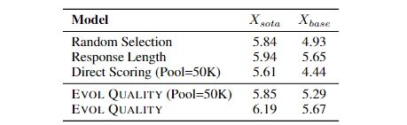

由于作者选择的打分模型是ChatGPT，而大部分SFT数据都是基于ChatGPT构建，或许是未能较好完成质量筛选的主要原因。此外，**以response长度作为SFT数据选择偏好**在另一文中也证实十分有效，结果如图2.2[^12]。

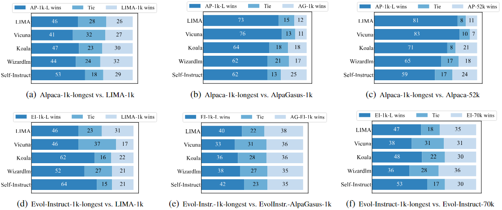

作者认为该策略简单却好用的原因在于，response更长的样本：

1. 天然具备更多信息、包含更多与Instruction相关的features；
2. 更难被memorized，迫使模型去学习而非记忆；
3. 使模型学会更好地处理long-term语义关系。

但是作者也强调，response更长的样本并不一定意味着更高的数据质量。

## 2.2 Learning or Align：SFT中的幻觉问题

LIMA中有一句话笔者十分赞同：**SFT的目的是行为标准或准则的对齐，本质在于align而非learning**。

> **Superficial Alignment Hypothesis**: A model's knowledge and capabilities are learnt almost entirely during pretraining, while alignment teaches it which subdistribution of formats should be used when interacting with users.

实际上，基于非同源chat模型合成response并进行训练，都可以理解为**sequence-level的distill**。然而Teacher model与Student model的Inner knowledge并不相同，从而align变成了align + memorization。**在缺乏足够多样、频次的knowledge的情况下（SFT变为continue pretrain），这些与Inner knowledge相冲的SFT样本反而可能诱发幻觉现象**。

伯克利的团队基于分类场景实验发现，随着SFT数据中unfamiliar样本（Instruction涉及LLM没有的知识）占比的提高，（尤其在面对unfamiliar数据时）模型幻觉现象也会随之加重，但如果将这部分unfamiliar样本的response修改为拒识则有所缓解[^13]。

腾讯团队在SFT时尝试对与Inner knowledge相冲的样本进行3种优化策略：1) 开卷（在Instruction中添加背景知识），2) 丢弃，3) 拒识；并分别进行实验，发现3种策略对缓解幻觉问题均有效，结合helpful得分和下游测试，**丢弃是相对最稳妥的策略**，具体结果如下图[^14]。

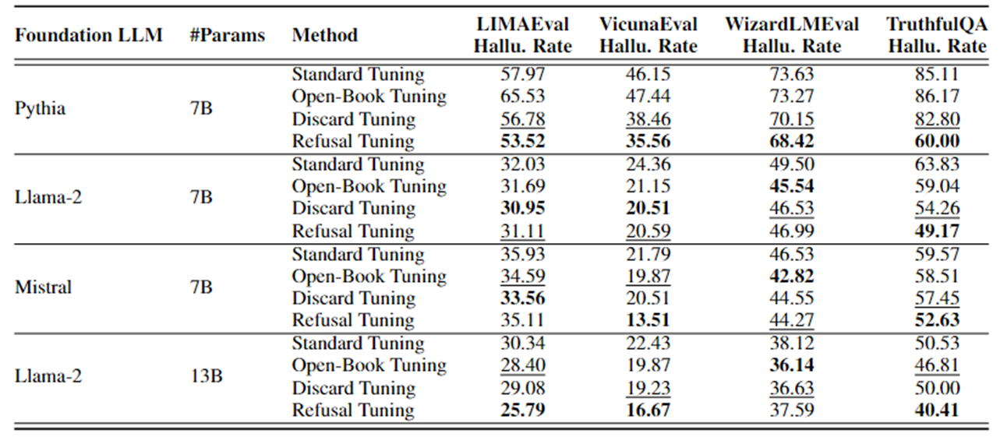

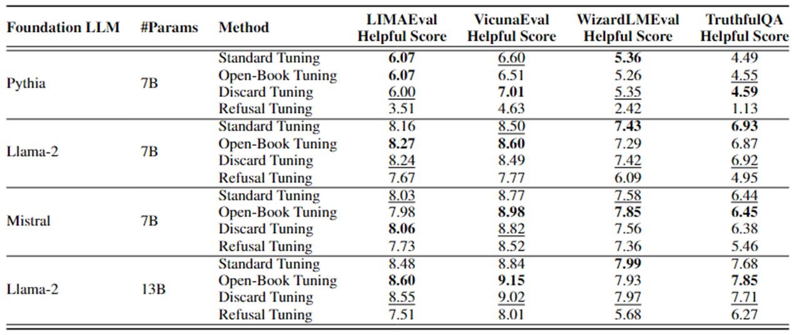

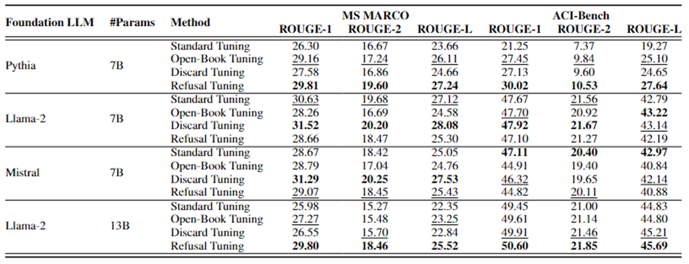

美团的团队也进行行了类似的实验，相比直接丢弃或拒识，该团队基于HAR（Harmonious，SFT数据涉及的知识与LLM一致）、INC（Incompatible，SFT数据涉及的知识与LLM相冲，模型需要学习align+knowledge）、SELF（Self-align，将INC数据中相冲的知识**修改为与LLM一致**）三份SFT数据，分别在HOMO（同源）、ID（非同源但同领域）、OOD（领域外）测试集上进行了实验，具体结果如下图，从结果显然可以看出Harmonious > Self-align > Incompatible[^15]。

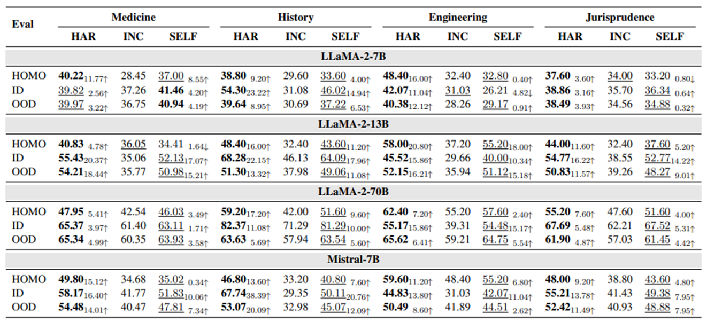

此外，作者通过绘制SFT效果、SFT前后知识一致程度的回归曲线发现，**SFT的关键在于保持SFT前后LLM的知识或知识结构基本一致。**这个结论比之前更进了一步：不仅要保证SFT数据的知识与LLM一致，也要防止灾难性遗忘、过拟合等问题。

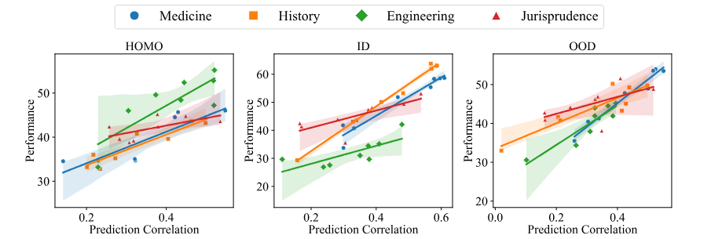

综上所述，既然SFT是LLM与人类期望行为准则或规范的对齐过程，使**模型专注于学习“基于Context & Inner knowledge与用户进行交互的行为准则”**是十分合理的。Yi对SFT数据的筛选策略也是相似的道理。

> to reduce hallucinations, we examine and ensure that the knowledge in the responses is not contained within the model, and eliminate responses that might lead to memorization;

# 03 复杂性

使用更复杂的数据更往往能使SFT的效率更高、效果更好，复杂度涉及的维度很多，**长度更长、指令更难、意图更多、表述更复杂等**都可以作为衡量标准之一。

## 3.1 复杂样本合成

**WizardLM**是非常经典的complex SFT数据构建方案，该方法对开放域、部分垂域场景都具备较好的适应性：借助PE+能力强大的chat模型，对Instructions进行持续迭代地**复杂化**，并过滤掉复杂程度未增加的、难度过高以至于模型拒答等进化失败的样本，以此获得复杂程度更高的SFT数据集[^7]。

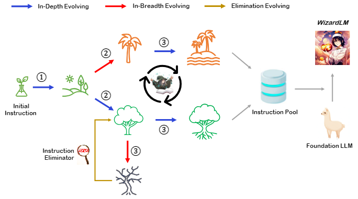

WizardLM定义了1种广度进化、5种深度进化，后者具体包括：

1. add constraints：在Instruction中添加额外限制条件；
2. deepening：深化问题难度；
3. concretizing：将通用概念具象化，譬如"1+1=?"变为"1个苹果+1个香蕉=?个水果"；
4. increase reasoning steps：要求增加推理过程；
5. complicate input：对输入复杂化，一般有固定的形式和in-context examples辅助chat模型进行生成。

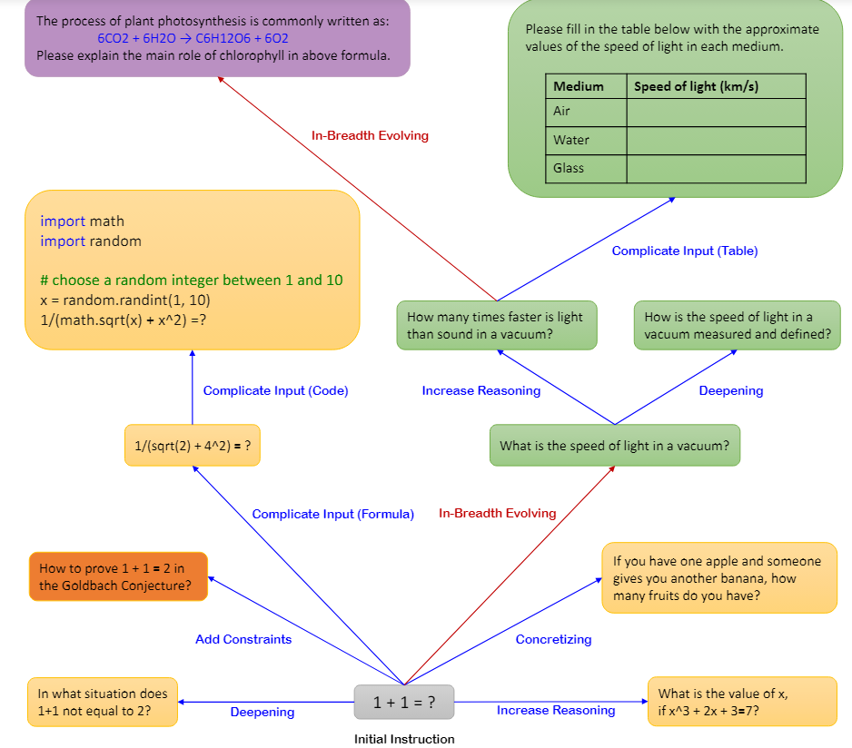

## 3.2 复杂样本筛选

**利用困惑度进行复杂性评估与数据筛选**是相对直观的做法之一。例如在IFD一文中，作者使用response with/without Instruction的困惑度变化，来衡量指令的质量与复杂程度，具体如下式[^16]。

$$
IFD(Instruction,Response)=  \frac{\mathrm{perplexity}(Response|Instruction)} {\mathrm{perplexity}(Response)} \tag{3.1}
$$

IFD代表response从Instruction中获得的收益大小、也反映了response/Instruction的对齐程度，直观上看，IFD值越大则代表该样本对齐效果越好、Instruction难度更高，IFD小于1时则代表该样本质量较低、可以直接过滤。利用困惑度进行复杂性评估时，最好使用与SFT模型相同的模型，因为**不同模型的Inner knowledge不同，困惑度未必具备迁移性**。

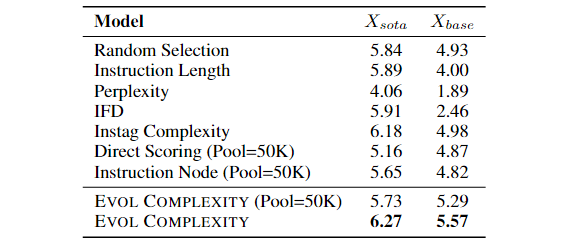

DEITA一文中同样对部分复杂性筛选策略进行了评估，具体包括以下方法[^11]：

1. Instruction长度；
2. Perplexity：responses的困惑度；
3. IFD；
4. Instag：**在具备较好的tagging方法与标签体系的情况下，标签个数也可以作为Instruction复杂度的充分条件**，此处使用了Instag tagging方法[^17]；
5. Direct Scoring：基于ChatGPT对Instruction的难度和复杂度做打分；
6. Instrucion Node：利用ChatGPT对Instruction进行语义解析，根据语法树的节点个数判断复杂度；
7. Evol Complexity：使用wizardLM的方式对指令复杂化，合成训练数据并**自建模型预测复杂度**。

结果如图3.3，只有Instag和Evol稳定超过基线，IFD在质量较低的SFT数据上表现较差，由于作者未透露细节因此无法分析具体原因。Instruction长度、response困惑度基本算是凑数的显然效果一般，值得注意的是，作者发现response困惑度高的样本反而长度更低，这与2.1节中的结论也呼应上了。

# 04 多样性

**多样性可以理解为意图、语义、领域、问句形式等维度的丰富程度，由于SFT是LLM与人类期望行为准则或规范的对齐过程，因此多样性更高的数据集理所当然具备更好、更广泛、更具一般性的对齐效果**。很多paper都验证过多样性对SFT的重要性，甚至将不同SFT数据简单合并也能使LLM获得收益[^18]。

## 4.1 多样样本合成

**Self-Instruct**是目前比较常见的diverse SFT数据构建方案，该方法对开放域、部分垂域场景都具备较好的适应性：借助PE+能力强大的chat模型，基于Instruction seeds进行持续迭代地**扩散**，让chat模型产生更多场景相似、形式多样的Instructions，进行简单的质量/多样性过滤之后，就可以作为训练SFT模型的启动数据[^19][^20][^21]。

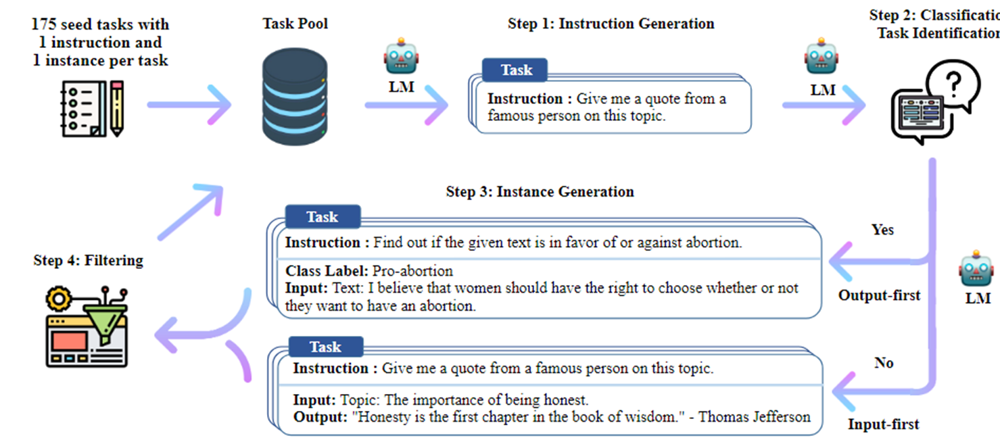

早期的Alpaca就是Self-Instruct的典型案例，UltraChat也基于类似思想产生了更高质量的对话数据，但是后者在seeds的处理上更加复杂，并且为对话场景设计了更合理的扩散方案[^20][^22]。

## 4.2 多样样本筛选

**预设（单级甚至多级）标签体系、基于tagging模型控制SFT数据标签分布**，是业界比较普遍的多样性把控策略，标签体系一般根据任务类型进行划分。3.2节提及的Instag也是一种基于tagging的数据处理方法，但**Instag不预设标签体系，而是先让ChatGPT自由发挥、再对标签过滤及归一**，因此标签体系更加丰富多样，标签分布如图4.2[^17]。

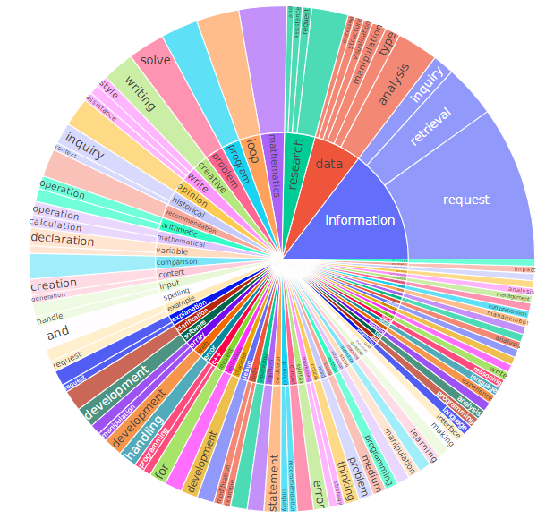

Instag的筛选策略也很简洁：对SFT数据按照标签个数降序排列，遍历SFT样本、若样本能丰富子集标签集合则将该样本加入子集，直至子集size符合预期，**该策略对标签体系比较丰富的数据比较友好**，具体实验结果如图4.3。

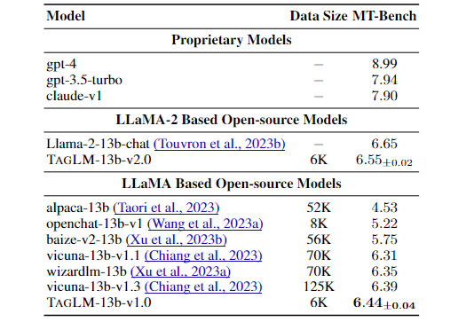

DEITA一文中同样对多样性筛选策略进行了评估，具体包括Instag和**Repr Filter（先基于complexity和quality挑选seeds，使用LLM+embding的方式，最近邻余弦距离小于阈值才加入子集，因此实际上结合了质量、复杂度、多样性三个维度）**，实验结果如下图[^11]。

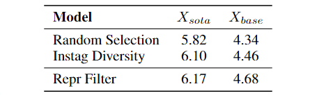

# 05 总结

本文从质量、复杂度、多样性三个角度介绍了一些比较好的SFT数据自动生成及筛选策略。总结全文，除了GPT打分、基于微调模型进行筛选的策略以外，其他简单易行的方法包括：

1. 质量：挑选response长度较长的样本；
2. 复杂度：挑选IFD较高，或标签数较多的样本；
3. 多样性：基于标签分布进行过滤。

如果综合考虑3个维度，一般可以从diversity-first或diversity-last角度进行筛选：

1. diversity-first：先进行打标，在控制整体标签分布的前提下，对各标签数据基于质量及复杂度进行筛选、补充，这也是业内相对简单、普遍的做法；
2. diversity-last：先对SFT数据基于质量及复杂度排序，再逐个向子集添加对标签集合有增益的样本，譬如DEITA。

在DPO、PPO等更强大的对齐算法面前，SFT往往只被定位为pretrain和RL之间一个临时的中间状态，什么是合理的数据量/数据配比、如何在SFT阶段更高效的对齐、数据筛选时使用更多的数据or使用更少更好但更多的epochs等问题仍未得到较好研究，但不得不说，在大多数依赖PE难以较好解决的应用场景，简单轻便的SFT仍是完成对齐任务的主力。

---

# 参考资料

[^1]: Llama 2: Open Foundation and Fine-Tuned Chat Models [https://arxiv.org/pdf/2307.09288](https://arxiv.org/pdf/2307.09288)
[^2]: DeepSeekMoE: Towards Ultimate Expert Specialization in Mixture-of-Experts Language Models [https://arxiv.org/pdf/2401.06066](https://arxiv.org/pdf/2401.06066)
[^3]: LongAlign: A Recipe for Long Context Alignment of Large Language Models [https://arxiv.org/pdf/2401.18058](https://arxiv.org/pdf/2401.18058)
[^4]: QWEN TECHNICAL REPORT [https://arxiv.org/pdf/2309.16609](https://arxiv.org/pdf/2309.16609)
[^5]: Baichuan 2: Open Large-scale Language Models [https://arxiv.org/pdf/2309.10305](https://arxiv.org/pdf/2309.10305)
[^6]: Yi: Open Foundation Models by 01.AI [https://arxiv.org/pdf/2403.04652](https://arxiv.org/pdf/2403.04652)
[^7]: WizardLM: Empowering Large Language Models to Follow Complex Instructions [https://arxiv.org/pdf/2304.12244](https://arxiv.org/pdf/2304.12244)
[^8]: DeepSeek LLM Scaling Open-Source Language Models with Longtermism [https://arxiv.org/pdf/2401.02954](https://arxiv.org/pdf/2401.02954)
[^9]: DeepSeek-V2: A Strong, Economical, and Efficient Mixture-of-Experts Language Model [https://arxiv.org/pdf/2405.04434](https://arxiv.org/pdf/2405.04434)
[^10]: LIMA: Less Is More for Alignment [https://proceedings.neurips.cc/paper_files/paper/2023/file/ac662d74829e4407ce1d126477f4a03a-Paper-Conference.pdf](https://proceedings.neurips.cc/paper_files/paper/2023/file/ac662d74829e4407ce1d126477f4a03a-Paper-Conference.pdf)
[^11]: WHAT MAKES GOOD DATA FOR ALIGNMENT? A COMPREHENSIVE STUDY OF AUTOMATIC DATA SELECTION IN INSTRUCTION TUNING [https://arxiv.org/pdf/2312.15685](https://arxiv.org/pdf/2312.15685)
[^12]: Long Is More for Alignment: A Simple but Tough-to-Beat Baseline for Instruction Fine-Tuning [https://arxiv.org/pdf/2402.04833.pdf](https://arxiv.org/pdf/2402.04833.pdf)
[^13]: Unfamiliar Finetuning Examples Control How Language Models Hallucinate [https://arxiv.org/pdf/2403.05612](https://arxiv.org/pdf/2403.05612)
[^14]: Knowledge Verification to Nip Hallucination in the Bud [https://arxiv.org/pdf/2401.10768](https://arxiv.org/pdf/2401.10768)
[^15]: Learning or Self-aligning? Rethinking Instruction Fine-tuning [https://arxiv.org/pdf/2402.18243](https://arxiv.org/pdf/2402.18243)
[^16]: From Quantity to Quality: Boosting LLM Performance with Self-Guided Data Selection for Instruction Tuning [https://arxiv.org/pdf/2308.12032](https://arxiv.org/pdf/2308.12032)
[^17]: #INSTAG: INSTRUCTION TAGGING FOR ANALYZ-ING SUPERVISED FINE-TUNING OF LARGE LANGUAGE MODELS [https://arxiv.org/pdf/2308.07074](https://arxiv.org/pdf/2308.07074)
[^18]: How Far Can Camels Go? Exploring the State of Instruction Tuning on Open Resources [https://proceedings.neurips.cc/paper_files/paper/2023/file/ec6413875e4ab08d7bc4d8e225263398-Paper-Datasets_and_Benchmarks.pdf](https://proceedings.neurips.cc/paper_files/paper/2023/file/ec6413875e4ab08d7bc4d8e225263398-Paper-Datasets_and_Benchmarks.pdf)
[^19]: SELF-INSTRUCT: Aligning Language Models with Self-Generated Instructions [https://aclanthology.org/2023.acl-long.754.pdf](https://aclanthology.org/2023.acl-long.754.pdf)
[^20]: Stanford Alpaca: An Instruction-following LLaMA Model [https://github.com/tatsu-lab/stanford_alpaca](https://github.com/tatsu-lab/stanford_alpaca)
[^21]: INSTRUCTION TUNING WITH GPT-4 [https://arxiv.org/pdf/2304.03277](https://arxiv.org/pdf/2304.03277)
[^22]: Enhancing Chat Language Models by Scaling High-quality Instructional Conversations [https://arxiv.org/pdf/2305.14233](https://arxiv.org/pdf/2305.14233)
